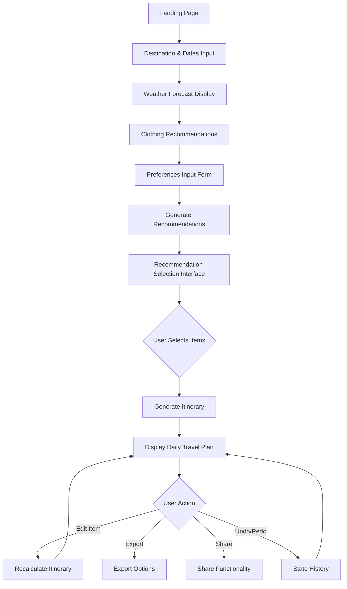
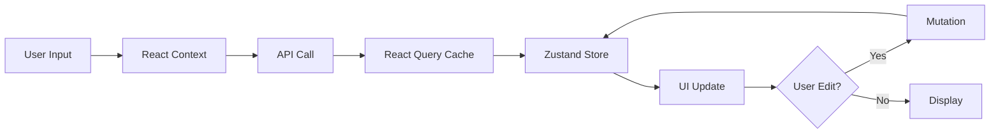

# Smart Travel Planning Application - Architectural Plan

## Executive Summary

This document outlines the comprehensive architecture, user flow, and implementation strategy for a smart travel planning web application built with Next.js 14+, React, TypeScript, and Tailwind CSS. The application generates AI-driven, customizable travel itineraries through a two-phase architecture: recommendation selection followed by itinerary generation.

## Table of Contents

1. [Core Architecture Principles](#core-architecture-principles)
2. [Technology Stack](#technology-stack)
3. [User Flow Diagram](#user-flow-diagram)
4. [Component Architecture](#component-architecture)
5. [State Management Strategy](#state-management-strategy)
6. [API Design](#api-design)
7. [Data Models](#data-models)
8. [Implementation Phases](#implementation-phases)

---

## Core Architecture Principles

### Two-Phase Architecture (CRITICAL)

The application MUST maintain strict separation between two distinct phases:

**Phase 1: Recommendation Generation**

- System generates curated list of places, hotels, and restaurants
- User reviews and selects items from this list
- No itinerary exists yet - this is pure selection

**Phase 2: Itinerary Generation**

- System processes user selections
- Generates chronological, linear daily travel plan
- Includes cultural context and practical information

**Key Rule**: These phases MUST NOT be combined. User selection is a required intermediate step.

### Dynamic Recalculation

- Any edit to the itinerary triggers full AI recalculation
- System maintains consistency across all days
- Undo/redo functionality for user confidence
- Efficient state management to handle recalculation overhead

### Server-First Approach

- Default to Server Components for performance
- Client Components only when necessary:
  - Forms and user input
  - Interactive selections
  - Real-time edits
  - State-dependent UI

---

## Technology Stack

### Core Framework

- **Next.js 14+**: App Router architecture
- **React 18+**: Server and Client Components
- **TypeScript**: Strict mode enabled
- **Tailwind CSS**: Utility-first styling

### State Management

- **React Context**: Multi-step form data (destination, dates, preferences)
- **Zustand**: Complex itinerary state (undo/redo, edit tracking)
- **React Query (TanStack Query)**: Server data caching and synchronization

### Form Handling

- **React Hook Form**: Form state management
- **Zod**: Schema validation

### API Integration

- **OpenAI API**: AI-powered recommendations and itinerary generation
- **Weather API**: Real-time weather forecasts
- **Google Maps API** (optional): Location data and mapping

### Development Tools

- **ESLint**: Code linting
- **Prettier**: Code formatting
- **TypeScript**: Type checking

---

## User Flow Diagram



### Detailed User Flow Steps

#### Step 1: Destination and Dates Input

- **Component**: `DestinationForm` (Client Component)
- **Input Fields**:
  - Destination (text input with autocomplete)
  - Start date (date picker)
  - End date (date picker)
  - Number of travelers (number input)
- **Validation**: Dates must be valid, end date after start date
- **State**: Stored in React Context
- **Next Action**: Fetch weather data

#### Step 2: Weather Forecast Display

- **Component**: `WeatherForecast` (Server Component)
- **Data Source**: Weather API
- **Display**:
  - Daily temperature range
  - Precipitation probability
  - Weather conditions (sunny, rainy, etc.)
  - UV index
- **Next Action**: Show clothing recommendations

#### Step 3: Clothing Recommendations

- **Component**: `ClothingRecommendations` (Server Component)
- **Logic**: Based on weather data
- **Display**:
  - Suggested clothing items
  - Layering recommendations
  - Accessories (umbrella, sunscreen, etc.)
- **Next Action**: Collect user preferences

#### Step 4: Preferences Input

- **Component**: `PreferencesForm` (Client Component)
- **Input Fields**:
  - Budget range (slider or select)
  - Meal preferences (breakfast, lunch, dinner times)
  - Rest time preferences (afternoon break, early evening)
  - Group dynamics (family, solo, couple, friends)
  - Transportation preferences (walking, public transit, car, mix)
  - Travel style (relaxed, moderate, packed, adventure)
  - Dietary restrictions (optional)
  - Accessibility needs (optional)
- **Validation**: Zod schema validation
- **State**: Stored in React Context
- **Next Action**: Generate recommendations

#### Step 5: Recommendation Generation (CRITICAL PHASE 1)

- **Component**: `RecommendationGenerator` (Server Component wrapper)
- **API Call**: `/api/recommendations`
- **Process**:
  1. Send destination, dates, and preferences to AI
  2. AI generates curated list of:
     - Tourist attractions and activities
     - Hotels/accommodations
     - Restaurants and cafes
  3. Each recommendation includes:
     - Name and description
     - Category (attraction, hotel, restaurant)
     - Estimated time needed
     - Price range
     - Location
     - Opening hours
     - Cultural notes
- **Display**: Loading state during generation
- **Next Action**: Show selection interface

#### Step 6: Recommendation Selection Interface (CRITICAL)

- **Component**: `RecommendationSelector` (Client Component)
- **Features**:
  - Categorized view (attractions, hotels, restaurants)
  - Filter by category, price, location
  - Search functionality
  - Card-based layout with images
  - Selection checkboxes
  - Selected items counter
  - "Generate Itinerary" button (disabled until selections made)
- **State**: Zustand store for selections
- **Validation**: Minimum selections required (e.g., at least 1 hotel, 3 attractions)
- **Next Action**: Generate itinerary from selections

#### Step 7: Itinerary Generation (CRITICAL PHASE 2)

- **Component**: `ItineraryGenerator` (Server Component wrapper)
- **API Call**: `/api/itinerary`
- **Process**:
  1. Send selected items and preferences to AI
  2. AI generates chronological daily plan:
     - Day-by-day breakdown
     - Time slots for each activity
     - Travel time between locations
     - Meal times at selected restaurants
     - Rest periods
     - Cultural context and etiquette
     - Attire recommendations per activity
  3. Optimize for:
     - Logical geographic flow
     - Realistic timing
     - User preferences (pace, meal times)
- **Display**: Loading state with progress indicator
- **Next Action**: Display itinerary

#### Step 8: Itinerary Display and Editing

- **Component**: `ItineraryView` (Mixed: Server wrapper, Client interactive parts)
- **Display Structure**:
  - Day-by-day accordion or tabs
  - Timeline view for each day
  - Activity cards with:
    - Time slot
    - Activity name and description
    - Location with map link
    - Duration
    - Cultural notes
    - Attire suggestions
  - Edit buttons on each activity
- **Interactive Features**:
  - Drag-and-drop reordering (triggers recalculation)
  - Time adjustment (triggers recalculation)
  - Activity replacement (triggers recalculation)
  - Add/remove activities (triggers recalculation)
  - Undo/redo buttons
- **State**: Zustand store with history
- **Next Actions**: Export, share, or continue editing

---

## Component Architecture

### Directory Structure

```
app/
├── (routes)/
│   ├── page.tsx                    # Landing page
│   ├── plan/
│   │   ├── page.tsx                # Main planning flow
│   │   ├── destination/
│   │   │   └── page.tsx            # Step 1: Destination input
│   │   ├── weather/
│   │   │   └── page.tsx            # Step 2: Weather display
│   │   ├── preferences/
│   │   │   └── page.tsx            # Step 3: Preferences input
│   │   ├── recommendations/
│   │   │   └── page.tsx            # Step 4: Recommendation selection
│   │   └── itinerary/
│   │       └── page.tsx            # Step 5: Itinerary display
│   └── layout.tsx                  # Root layout
├── api/
│   ├── weather/
│   │   └── route.ts                # Weather API endpoint
│   ├── recommendations/
│   │   └── route.ts                # Recommendations generation
│   └── itinerary/
│       ├── route.ts                # Itinerary generation
│       └── recalculate/
│           └── route.ts            # Itinerary recalculation
components/
├── forms/
│   ├── DestinationForm.tsx         # Client Component
│   ├── PreferencesForm.tsx         # Client Component
│   └── FormField.tsx               # Reusable form field
├── weather/
│   ├── WeatherForecast.tsx         # Server Component
│   └── ClothingRecommendations.tsx # Server Component
├── recommendations/
│   ├── RecommendationCard.tsx      # Client Component
│   ├── RecommendationSelector.tsx  # Client Component
│   ├── CategoryFilter.tsx          # Client Component
│   └── SelectionSummary.tsx        # Client Component
├── itinerary/
│   ├── ItineraryView.tsx           # Mixed Component
│   ├── DayView.tsx                 # Client Component
│   ├── ActivityCard.tsx            # Client Component
│   ├── TimelineView.tsx            # Client Component
│   └── EditControls.tsx            # Client Component
├── ui/
│   ├── Button.tsx                  # Reusable UI components
│   ├── Card.tsx
│   ├── Input.tsx
│   ├── Select.tsx
│   ├── DatePicker.tsx
│   ├── Slider.tsx
│   └── LoadingSpinner.tsx
└── layout/
    ├── Header.tsx
    ├── Footer.tsx
    └── ProgressIndicator.tsx       # Shows current step
lib/
├── types/
│   ├── destination.ts
│   ├── preferences.ts
│   ├── recommendation.ts
│   └── itinerary.ts
├── validations/
│   ├── destination.schema.ts       # Zod schemas
│   ├── preferences.schema.ts
│   └── itinerary.schema.ts
├── api/
│   ├── weather.ts                  # Weather API client
│   ├── openai.ts                   # OpenAI API client
│   └── maps.ts                     # Maps API client (optional)
├── utils/
│   ├── date.ts                     # Date utilities
│   ├── format.ts                   # Formatting utilities
│   └── validation.ts               # Validation helpers
└── stores/
    ├── planningStore.ts            # React Context for form data
    ├── itineraryStore.ts           # Zustand for itinerary state
    └── selectionStore.ts           # Zustand for recommendations
```

### Component Specifications

#### Server Components (Default)

**WeatherForecast.tsx**

```typescript
// Server Component - fetches and displays weather
interface WeatherForecastProps {
  destination: string;
  startDate: Date;
  endDate: Date;
}

export async function WeatherForecast({
  destination,
  startDate,
  endDate,
}: WeatherForecastProps) {
  // Fetch weather data server-side
  // Render static weather display
}
```

**ClothingRecommendations.tsx**

```typescript
// Server Component - generates clothing suggestions
interface ClothingRecommendationsProps {
  weatherData: WeatherData;
}

export async function ClothingRecommendations({
  weatherData,
}: ClothingRecommendationsProps) {
  // Generate recommendations based on weather
  // Render static recommendations
}
```

#### Client Components (Interactive)

**DestinationForm.tsx**

```typescript
'use client';

// Client Component - handles user input
export function DestinationForm() {
  // React Hook Form setup
  // Form validation with Zod
  // Submit handler
  // Render form with inputs
}
```

**RecommendationSelector.tsx**

```typescript
'use client';

// Client Component - handles recommendation selection
interface RecommendationSelectorProps {
  recommendations: Recommendation[];
}

export function RecommendationSelector({
  recommendations,
}: RecommendationSelectorProps) {
  // Zustand store for selections
  // Filter and search logic
  // Selection handlers
  // Render recommendation cards with checkboxes
}
```

**ItineraryView.tsx**

```typescript
'use client';

// Client Component - handles itinerary display and editing
interface ItineraryViewProps {
  initialItinerary: Itinerary;
}

export function ItineraryView({ initialItinerary }: ItineraryViewProps) {
  // Zustand store with history
  // Edit handlers that trigger recalculation
  // Undo/redo logic
  // Render day-by-day view with edit controls
}
```

---

## State Management Strategy

### Three-Layer State Architecture

#### Layer 1: Form Data (React Context)

**Purpose**: Store multi-step form data that flows through the planning process

**Implementation**: `PlanningContext`

```typescript
interface PlanningContextValue {
  destination: string;
  startDate: Date;
  endDate: Date;
  travelers: number;
  preferences: UserPreferences;
  updateDestination: (data: DestinationData) => void;
  updatePreferences: (prefs: UserPreferences) => void;
  reset: () => void;
}
```

**Usage**:

- Destination and dates form
- Preferences form
- Read-only access in subsequent steps

**Rationale**: Simple, built-in React solution for linear form flow

#### Layer 2: Selection State (Zustand)

**Purpose**: Manage recommendation selections and itinerary state with history

**Implementation**: `useSelectionStore` and `useItineraryStore`

```typescript
// Selection Store
interface SelectionStore {
  selectedRecommendations: Recommendation[];
  addSelection: (rec: Recommendation) => void;
  removeSelection: (id: string) => void;
  clearSelections: () => void;
  isSelected: (id: string) => boolean;
}

// Itinerary Store with History
interface ItineraryStore {
  itinerary: Itinerary;
  history: Itinerary[];
  historyIndex: number;
  updateItinerary: (itinerary: Itinerary) => void;
  editActivity: (
    dayIndex: number,
    activityIndex: number,
    changes: Partial<Activity>,
  ) => void;
  undo: () => void;
  redo: () => void;
  canUndo: boolean;
  canRedo: boolean;
}
```

**Usage**:

- Recommendation selection interface
- Itinerary editing and recalculation
- Undo/redo functionality

**Rationale**: Zustand provides efficient state updates, middleware support for history, and better performance for complex state

#### Layer 3: Server Data (React Query)

**Purpose**: Cache and synchronize server data

**Implementation**: React Query hooks

```typescript
// Weather data
const { data: weather, isLoading } = useQuery({
  queryKey: ['weather', destination, startDate, endDate],
  queryFn: () => fetchWeather(destination, startDate, endDate),
  staleTime: 1000 * 60 * 30, // 30 minutes
});

// Recommendations
const { data: recommendations, isLoading } = useQuery({
  queryKey: ['recommendations', destination, preferences],
  queryFn: () => generateRecommendations(destination, preferences),
  staleTime: Infinity, // Don't refetch unless invalidated
});

// Itinerary with mutation
const { mutate: recalculateItinerary, isLoading } = useMutation({
  mutationFn: (editedItinerary: Itinerary) =>
    recalculateItinerary(editedItinerary),
  onSuccess: (newItinerary) => {
    itineraryStore.updateItinerary(newItinerary);
  },
});
```

**Usage**:

- Weather API calls
- Recommendation generation
- Itinerary generation and recalculation

**Rationale**: Automatic caching, loading states, error handling, and optimistic updates

### State Flow Diagram



---

## API Design

### API Route Structure

#### 1. Weather API (`/api/weather`)

**Method**: GET

**Query Parameters**:

- `destination`: string
- `startDate`: ISO date string
- `endDate`: ISO date string

**Response**:

```typescript
interface WeatherResponse {
  location: string;
  forecast: DailyForecast[];
}

interface DailyForecast {
  date: string;
  tempHigh: number;
  tempLow: number;
  condition: string;
  precipitation: number;
  uvIndex: number;
}
```

**Implementation**:

- Call external weather API (OpenWeatherMap, WeatherAPI, etc.)
- Transform data to consistent format
- Cache results for 30 minutes
- Error handling for invalid locations

#### 2. Recommendations API (`/api/recommendations`)

**Method**: POST

**Request Body**:

```typescript
interface RecommendationsRequest {
  destination: string;
  startDate: string;
  endDate: string;
  travelers: number;
  preferences: UserPreferences;
}
```

**Response**:

```typescript
interface RecommendationsResponse {
  attractions: Recommendation[];
  hotels: Recommendation[];
  restaurants: Recommendation[];
}

interface Recommendation {
  id: string;
  name: string;
  description: string;
  category: 'attraction' | 'hotel' | 'restaurant';
  estimatedDuration: number; // minutes
  priceRange: number; // 1-4
  location: {
    address: string;
    coordinates: { lat: number; lng: number };
  };
  openingHours: string;
  culturalNotes: string;
}
```

**Implementation**:

- Use OpenAI API to generate recommendations
- Structured prompt with user preferences
- Parse AI response into typed objects
- Validate and sanitize data
- Error handling and retry logic

**AI Prompt Structure**:

```
Generate travel recommendations for [destination] from [startDate] to [endDate].

User preferences:
- Budget: [budget]
- Travel style: [style]
- Group: [group]
- Transportation: [transport]

Provide 15-20 attractions, 5-7 hotels, and 10-15 restaurants.
Format as JSON with fields: name, description, category, estimatedDuration, priceRange, location, openingHours, culturalNotes.
```

#### 3. Itinerary Generation API (`/api/itinerary`)

**Method**: POST

**Request Body**:

```typescript
interface ItineraryRequest {
  destination: string;
  startDate: string;
  endDate: string;
  travelers: number;
  preferences: UserPreferences;
  selectedRecommendations: Recommendation[];
}
```

**Response**:

```typescript
interface ItineraryResponse {
  itinerary: Itinerary;
}

interface Itinerary {
  id: string;
  destination: string;
  startDate: string;
  endDate: string;
  days: DayPlan[];
}

interface DayPlan {
  date: string;
  activities: Activity[];
}

interface Activity {
  id: string;
  time: string;
  duration: number;
  type: 'attraction' | 'meal' | 'rest' | 'travel';
  recommendation: Recommendation;
  culturalContext: string;
  attireSuggestion: string;
  travelTime?: number; // to next activity
}
```

**Implementation**:

- Use OpenAI API to generate chronological plan
- Consider user preferences (meal times, rest periods, pace)
- Optimize geographic flow
- Calculate realistic travel times
- Add cultural context and attire suggestions
- Validate timing constraints
- Error handling and retry logic

**AI Prompt Structure**:

```
Create a detailed daily itinerary for [destination] from [startDate] to [endDate].

Selected items:
[List of selected recommendations]

User preferences:
- Breakfast time: [time]
- Lunch time: [time]
- Dinner time: [time]
- Rest period: [time]
- Travel style: [style]

Requirements:
1. Chronological order by day
2. Realistic timing with travel between locations
3. Include meals at selected restaurants
4. Add rest periods as requested
5. Optimize geographic flow
6. Include cultural context and attire suggestions for each activity

Format as JSON with structure: days[{date, activities[{time, duration, type, recommendation, culturalContext, attireSuggestion, travelTime}]}]
```

#### 4. Itinerary Recalculation API (`/api/itinerary/recalculate`)

**Method**: POST

**Request Body**:

```typescript
interface RecalculateRequest {
  currentItinerary: Itinerary;
  edit: {
    dayIndex: number;
    activityIndex: number;
    changes: Partial<Activity>;
  };
}
```

**Response**:

```typescript
interface RecalculateResponse {
  itinerary: Itinerary;
  changedDays: number[]; // indices of days that changed
}
```

**Implementation**:

- Apply user edit to itinerary
- Use OpenAI API to recalculate affected portions
- Maintain consistency across all days
- Optimize timing and flow
- Return updated itinerary with change tracking
- Error handling and rollback on failure

**AI Prompt Structure**:

```
Recalculate travel itinerary after user edit.

Original itinerary:
[Current itinerary JSON]

User edit:
Day [X], Activity [Y]: [Changes]

Requirements:
1. Apply the edit
2. Adjust subsequent activities on the same day
3. Ensure realistic timing
4. Maintain geographic flow
5. Keep other days consistent unless timing requires changes

Return full updated itinerary as JSON.
```

### API Error Handling

All API routes implement consistent error handling:

```typescript
try {
  // API logic
  return NextResponse.json({ data });
} catch (error) {
  console.error('API Error:', error);

  if (error instanceof ValidationError) {
    return NextResponse.json(
      { error: 'Invalid input', details: error.message },
      { status: 400 },
    );
  }

  if (error instanceof AIError) {
    return NextResponse.json(
      { error: 'AI service error', details: error.message },
      { status: 503 },
    );
  }

  return NextResponse.json({ error: 'Internal server error' }, { status: 500 });
}
```

---

## Data Models

### TypeScript Interfaces

```typescript
// lib/types/destination.ts
export interface DestinationData {
  destination: string;
  startDate: Date;
  endDate: Date;
  travelers: number;
}

// lib/types/preferences.ts
export interface UserPreferences {
  budget: 'budget' | 'moderate' | 'luxury';
  mealTimes: {
    breakfast: string; // HH:MM format
    lunch: string;
    dinner: string;
  };
  restPeriod?: {
    start: string;
    duration: number; // minutes
  };
  groupDynamics: 'solo' | 'couple' | 'family' | 'friends';
  transportation: 'walking' | 'public' | 'car' | 'mix';
  travelStyle: 'relaxed' | 'moderate' | 'packed' | 'adventure';
  dietaryRestrictions?: string[];
  accessibilityNeeds?: string[];
}

// lib/types/recommendation.ts
export interface Recommendation {
  id: string;
  name: string;
  description: string;
  category: 'attraction' | 'hotel' | 'restaurant';
  estimatedDuration: number; // minutes
  priceRange: 1 | 2 | 3 | 4;
  location: {
    address: string;
    coordinates: {
      lat: number;
      lng: number;
    };
  };
  openingHours: string;
  culturalNotes: string;
  imageUrl?: string;
}

// lib/types/itinerary.ts
export interface Itinerary {
  id: string;
  destination: string;
  startDate: string;
  endDate: string;
  days: DayPlan[];
  metadata: {
    createdAt: string;
    updatedAt: string;
    version: number;
  };
}

export interface DayPlan {
  date: string;
  activities: Activity[];
  summary: string;
}

export interface Activity {
  id: string;
  time: string; // HH:MM format
  duration: number; // minutes
  type: 'attraction' | 'meal' | 'rest' | 'travel';
  recommendation: Recommendation;
  culturalContext: string;
  attireSuggestion: string;
  travelTime?: number; // minutes to next activity
  notes?: string;
}

// lib/types/weather.ts
export interface WeatherData {
  location: string;
  forecast: DailyForecast[];
}

export interface DailyForecast {
  date: string;
  tempHigh: number;
  tempLow: number;
  condition: 'sunny' | 'cloudy' | 'rainy' | 'snowy' | 'windy';
  precipitation: number; // percentage
  uvIndex: number;
  humidity: number;
}
```

### Zod Validation Schemas

```typescript
// lib/validations/destination.schema.ts
import { z } from 'zod';

export const destinationSchema = z
  .object({
    destination: z.string().min(2, 'Destination must be at least 2 characters'),
    startDate: z.date(),
    endDate: z.date(),
    travelers: z.number().min(1).max(20),
  })
  .refine((data) => data.endDate > data.startDate, {
    message: 'End date must be after start date',
    path: ['endDate'],
  });

// lib/validations/preferences.schema.ts
export const preferencesSchema = z.object({
  budget: z.enum(['budget', 'moderate', 'luxury']),
  mealTimes: z.object({
    breakfast: z.string().regex(/^([0-1]?[0-9]|2[0-3]):[0-5][0-9]$/),
    lunch: z.string().regex(/^([0-1]?[0-9]|2[0-3]):[0-5][0-9]$/),
    dinner: z.string().regex(/^([0-1]?[0-9]|2[0-3]):[0-5][0-9]$/),
  }),
  restPeriod: z
    .object({
      start: z.string().regex(/^([0-1]?[0-9]|2[0-3]):[0-5][0-9]$/),
      duration: z.number().min(15).max(180),
    })
    .optional(),
  groupDynamics: z.enum(['solo', 'couple', 'family', 'friends']),
  transportation: z.enum(['walking', 'public', 'car', 'mix']),
  travelStyle: z.enum(['relaxed', 'moderate', 'packed', 'adventure']),
  dietaryRestrictions: z.array(z.string()).optional(),
  accessibilityNeeds: z.array(z.string()).optional(),
});
```

---

## Implementation Phases

### Phase 1: Foundation Setup (Week 1)

**Goal**: Establish project structure and core infrastructure

**Tasks**:

- [ ] Initialize Next.js 14+ project with TypeScript
- [ ] Configure Tailwind CSS
- [ ] Set up ESLint and Prettier
- [ ] Create directory structure (app/, components/, lib/)
- [ ] Define TypeScript interfaces and types
- [ ] Create Zod validation schemas
- [ ] Set up React Query provider
- [ ] Create basic layout components (Header, Footer)
- [ ] Implement error boundary
- [ ] Set up environment variables structure

**Deliverables**:

- Working Next.js app with proper structure
- Type definitions for all data models
- Validation schemas
- Basic UI components

**Testing**:

- TypeScript compilation without errors
- Linting passes
- Development server runs successfully

---

### Phase 2: Destination and Weather Flow (Week 2)

**Goal**: Implement Steps 1-2 of user flow

**Tasks**:

- [ ] Create landing page with hero section
- [ ] Build `DestinationForm` component
  - Destination input with autocomplete
  - Date picker for start/end dates
  - Travelers number input
  - Form validation with Zod
- [ ] Implement React Context for planning data
- [ ] Create `/api/weather` route
  - Integrate weather API
  - Transform and cache data
- [ ] Build `WeatherForecast` component
  - Display daily forecasts
  - Show temperature, conditions, precipitation
- [ ] Build `ClothingRecommendations` component
  - Generate suggestions based on weather
- [ ] Create progress indicator component
- [ ] Implement navigation between steps

**Deliverables**:

- Functional destination input form
- Weather forecast display
- Clothing recommendations
- Working navigation flow

**Testing**:

- Form validation works correctly
- Weather API returns accurate data
- Clothing recommendations match weather
- Navigation preserves form data

---

### Phase 3: Preferences Collection (Week 3)

**Goal**: Implement Step 3 of user flow

**Tasks**:

- [ ] Build `PreferencesForm` component
  - Budget selection (radio or select)
  - Meal time inputs (time pickers)
  - Rest period configuration
  - Group dynamics selection
  - Transportation preferences
  - Travel style selection
  - Dietary restrictions (multi-select)
  - Accessibility needs (multi-select)
- [ ] Implement form validation with Zod
- [ ] Add form state to React Context
- [ ] Create reusable form field components
  - Input
  - Select
  - TimePicker
  - Slider
  - MultiSelect
- [ ] Implement form persistence (localStorage)
- [ ] Add form review/edit capability

**Deliverables**:

- Complete preferences form
- Reusable form components
- Form validation and error handling
- Data persistence

**Testing**:

- All form fields validate correctly
- Form data persists across navigation
- Error messages display appropriately
- Form can be edited after submission

---

### Phase 4: Recommendation Generation (Week 4)

**Goal**: Implement Step 4 (Phase 1 of two-phase architecture)

**Tasks**:

- [ ] Create `/api/recommendations` route
  - Integrate OpenAI API
  - Design AI prompt for recommendations
  - Parse and validate AI response
  - Implement error handling and retries
- [ ] Build `RecommendationCard` component
  - Display recommendation details
  - Show selection checkbox
  - Handle selection state
- [ ] Build `RecommendationSelector` component
  - Category tabs (attractions, hotels, restaurants)
  - Filter controls
  - Search functionality
  - Selection counter
  - "Generate Itinerary" button
- [ ] Implement Zustand store for selections
- [ ] Add React Query for recommendations caching
- [ ] Create loading states and error handling
- [ ] Implement selection validation
  - Minimum selections required
  - Maximum selections allowed

**Deliverables**:

- Working recommendations API
- Recommendation selection interface
- Selection state management
- Validation and error handling

**Testing**:

- AI generates relevant recommendations
- Selection state updates correctly
- Filters and search work properly
- Validation prevents invalid selections
- Loading and error states display correctly

---

### Phase 5: Itinerary Generation (Week 5)

**Goal**: Implement Step 5 (Phase 2 of two-phase architecture)

**Tasks**:

- [ ] Create `/api/itinerary` route
  - Integrate OpenAI API
  - Design AI prompt for itinerary
  - Parse and validate AI response
  - Implement error handling and retries
- [ ] Build `ItineraryView` component
  - Day-by-day layout
  - Timeline visualization
  - Activity cards
- [ ] Build `DayView` component
  - Collapsible day sections
  - Activity list
  - Day summary
- [ ] Build `ActivityCard` component
  - Time and duration display
  - Activity details
  - Cultural context
  - Attire suggestions
  - Map link
- [ ] Implement Zustand store for itinerary
- [ ] Add React Query for itinerary caching
- [ ] Create loading states with progress
- [ ] Implement error handling

**Deliverables**:

- Working itinerary generation API
- Itinerary display interface
- Day and activity components
- State management for itinerary

**Testing**:

- AI generates logical itinerary
- Timeline is chronologically correct
- Activities match selected recommendations
- Cultural context is relevant
- Loading states work correctly

---

### Phase 6: Itinerary Editing and Recalculation (Week 6-7)

**Goal**: Implement Step 6 with dynamic recalculation

**Tasks**:

- [ ] Create `/api/itinerary/recalculate` route
  - Accept edit parameters
  - Recalculate affected portions
  - Maintain consistency
  - Return updated itinerary
- [ ] Build `EditControls` component
  - Edit button for each activity
  - Time adjustment controls
  - Activity replacement
  - Add/remove activity
- [ ] Implement edit modal/drawer
  - Edit form for activity details
  - Time picker
  - Duration adjustment
  - Save/cancel buttons
- [ ] Add drag-and-drop reordering
  - Within same day
  - Trigger recalculation
- [ ] Implement undo/redo functionality
  - History tracking in Zustand
  - Undo/redo buttons
  - Keyboard shortcuts
- [ ] Add optimistic updates
  - Immediate UI feedback
  - Rollback on error
- [ ] Implement loading states during recalculation
- [ ] Add conflict detection
  - Overlapping times
  - Unrealistic travel times

**Deliverables**:

- Working recalculation API
- Edit controls and modal
- Drag-and-drop functionality
- Undo/redo system
- Optimistic updates

**Testing**:

- Edits trigger recalculation correctly
- Recalculated itinerary is consistent
- Undo/redo works properly
- Drag-and-drop updates state
- Optimistic updates roll back on error
- Conflicts are detected and handled

---

### Phase 7: Polish and Enhancement (Week 8)

**Goal**: Improve UX and add finishing touches

**Tasks**:

- [ ] Implement export functionality
  - PDF export
  - Calendar export (iCal)
  - Email itinerary
- [ ] Add share functionality
  - Generate shareable link
  - Social media sharing
- [ ] Improve loading states
  - Skeleton screens
  - Progress indicators
  - Animated transitions
- [ ] Add empty states
  - No recommendations
  - No selections
  - API errors
- [ ] Implement responsive design
  - Mobile optimization
  - Tablet layout
  - Desktop enhancements
- [ ] Add accessibility features
  - ARIA labels
  - Keyboard navigation
  - Screen reader support
- [ ] Implement analytics
  - Track user flow
  - Monitor API performance
  - Error tracking
- [ ] Add user feedback mechanisms
  - Success messages
  - Error notifications
  - Confirmation dialogs

**Deliverables**:

- Export and share features
- Polished loading and empty states
- Responsive design
- Accessibility improvements
- Analytics integration

**Testing**:

- Export formats work correctly
- Share links are valid
- Responsive design works on all devices
- Accessibility audit passes
- Analytics tracks events correctly

---

### Phase 8: Testing and Optimization (Week 9)

**Goal**: Ensure quality and performance

**Tasks**:

- [ ] Write unit tests
  - Component tests (React Testing Library)
  - Utility function tests
  - Validation schema tests
- [ ] Write integration tests
  - API route tests
  - User flow tests
  - State management tests
- [ ] Perform end-to-end testing
  - Complete user flows
  - Error scenarios
  - Edge cases
- [ ] Optimize performance
  - Code splitting
  - Image optimization
  - API response caching
  - Bundle size reduction
- [ ] Conduct accessibility audit
  - WCAG compliance
  - Screen reader testing
  - Keyboard navigation
- [ ] Perform security audit
  - API key protection
  - Input sanitization
  - XSS prevention
- [ ] Load testing
  - API endpoint stress testing
  - Concurrent user simulation

**Deliverables**:

- Comprehensive test suite
- Performance optimizations
- Accessibility compliance
- Security hardening
- Load testing results

**Testing**:

- All tests pass
- Performance metrics meet targets
- Accessibility audit passes
- Security vulnerabilities addressed
- Load testing shows acceptable performance

---

### Phase 9: Deployment and Monitoring (Week 10)

**Goal**: Deploy to production and set up monitoring

**Tasks**:

- [ ] Set up production environment
  - Configure environment variables
  - Set up database (if needed)
  - Configure API keys
- [ ] Deploy to Vercel/hosting platform
  - Configure build settings
  - Set up custom domain
  - Configure CDN
- [ ] Set up monitoring
  - Error tracking (Sentry)
  - Performance monitoring
  - Uptime monitoring
- [ ] Configure CI/CD pipeline
  - Automated testing
  - Automated deployment
  - Rollback procedures
- [ ] Create documentation
  - User guide
  - API documentation
  - Deployment guide
- [ ] Perform final testing in production
  - Smoke tests
  - User acceptance testing
  - Performance validation

**Deliverables**:

- Production deployment
- Monitoring and alerting
- CI/CD pipeline
- Documentation
- Production validation

**Testing**:

- Production environment works correctly
- Monitoring captures errors
- CI/CD pipeline deploys successfully
- Documentation is complete and accurate

---

## Success Metrics

### User Experience Metrics

- **Task Completion Rate**: >90% of users complete full flow
- **Time to Itinerary**: <5 minutes from start to generated itinerary
- **Edit Success Rate**: >95% of edits result in valid recalculation
- **User Satisfaction**: >4.5/5 rating

### Technical Metrics

- **Page Load Time**: <2 seconds for initial load
- **API Response Time**: <3 seconds for recommendations, <5 seconds for itinerary
- **Error Rate**: <1% of API calls fail
- **Uptime**: >99.9% availability

### Business Metrics

- **User Retention**: >60% return within 30 days
- **Recommendation Acceptance**: >70% of recommendations selected
- **Itinerary Completion**: >80% of generated itineraries are used

---

## Risk Mitigation

### Technical Risks

**Risk**: AI API failures or slow responses

- **Mitigation**: Implement retry logic, fallback responses, timeout handling
- **Contingency**: Cache previous successful responses, provide manual input option

**Risk**: State management complexity

- **Mitigation**: Use proven libraries (Zustand, React Query), implement comprehensive testing
- **Contingency**: Simplify state structure, reduce undo history depth

**Risk**: Performance issues with large itineraries

- **Mitigation**: Implement pagination, lazy loading, code splitting
- **Contingency**: Limit itinerary length, optimize rendering

### User Experience Risks

**Risk**: Users confused by two-phase architecture

- **Mitigation**: Clear progress indicators, explanatory text, onboarding flow
- **Contingency**: Add tutorial, provide examples, simplify UI

**Risk**: Recalculation takes too long

- **Mitigation**: Optimistic updates, progress indicators, partial recalculation
- **Contingency**: Reduce recalculation scope, cache intermediate results

**Risk**: Recommendations not relevant

- **Mitigation**: Refine AI prompts, add user feedback mechanism, improve preference collection
- **Contingency**: Allow manual addition of items, provide more filter options

---

## Future Enhancements

### Phase 10+ (Post-Launch)

**Advanced Features**:

- [ ] User accounts and saved itineraries
- [ ] Collaborative planning (multiple users)
- [ ] Real-time collaboration
- [ ] Mobile app (React Native)
- [ ] Offline mode
- [ ] Integration with booking platforms
- [ ] Budget tracking
- [ ] Expense splitting
- [ ] Photo gallery
- [ ] Travel journal
- [ ] Social features (share trips, follow travelers)
- [ ] AI chat assistant for questions
- [ ] Multi-destination trips
- [ ] Seasonal recommendations
- [ ] Local events integration
- [ ] Transportation booking
- [ ] Restaurant reservations

**Technical Improvements**:

- [ ] GraphQL API
- [ ] WebSocket for real-time updates
- [ ] Progressive Web App (PWA)
- [ ] Advanced caching strategies
- [ ] Machine learning for personalization
- [ ] A/B testing framework
- [ ] Advanced analytics
- [ ] Internationalization (i18n)
- [ ] Multi-language support

---

## Conclusion

This architectural plan provides a comprehensive roadmap for building a smart travel planning application with a clear two-phase architecture, robust state management, and dynamic recalculation capabilities. The phased implementation approach ensures steady progress while maintaining code quality and user experience.

Key success factors:

1. **Strict adherence to two-phase architecture** - Never combine recommendation selection and itinerary generation
2. **Efficient state management** - Use appropriate tools for each layer
3. **Robust API design** - Handle errors, implement retries, optimize performance
4. **User-centric design** - Clear flow, helpful feedback, responsive interface
5. **Comprehensive testing** - Unit, integration, and end-to-end tests

By following this plan, the development team can build a production-ready travel planning application that delivers exceptional user experience and maintains high code quality.
