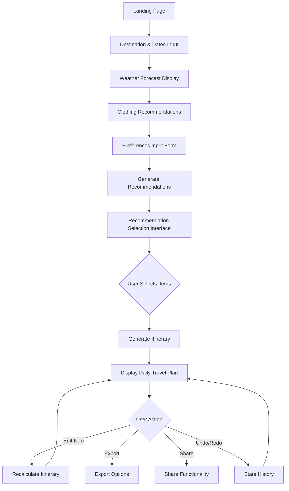
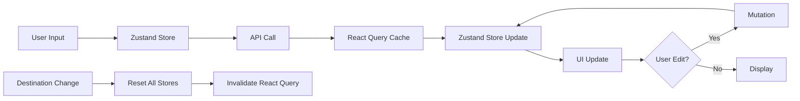

# Smart Travel Planning Application - Architectural Plan

## Executive Summary

This document outlines the comprehensive architecture, user flow, and implementation strategy for a smart travel planning web application built with Next.js 14+, React, TypeScript, and Tailwind CSS. The application features an AI travel assistant that generates personalized, customizable travel itineraries through a streamlined flow: preferences collection → contextual recommendations → itinerary generation with AI assistant support.

## Table of Contents

1. [Core Architecture Principles](#core-architecture-principles)
2. [Technology Stack](#technology-stack)
3. [Design System](#design-system)
4. [User Flow Diagram](#user-flow-diagram)
5. [Component Architecture](#component-architecture)
6. [AI Assistant Integration](#ai-assistant-integration)
7. [State Management Strategy](#state-management-strategy)
8. [API Design](#api-design)
9. [Data Models](#data-models)
10. [Error Handling & Resilience Architecture](#error-handling--resilience-architecture)
11. [Performance & Optimization Strategy](#performance--optimization-strategy)
12. [Testing Architecture & Quality Assurance](#testing-architecture--quality-assurance)
13. [Cost Analysis & Monetization Strategy](#cost-analysis--monetization-strategy)
14. [Implementation Phases](#implementation-phases)
15. [Success Metrics](#success-metrics)
16. [Risk Mitigation](#risk-mitigation)
17. [Future Enhancements](#future-enhancements)

---

## Core Architecture Principles

### AI Assistant Integration

**AI as Travel Companion**: The application features an AI assistant focused on core planning features. The AI provides:

- **Core AI Features** (where AI adds most value):
  - Contextual recommendations based on user preferences
  - Itinerary generation with optimal routing and timing
  - Real-time suggestions and alternatives via chat interface
  - Answers to travel-related questions
  - Proactive assistance (e.g., suggesting nearby cafes when there's a gap in the itinerary)

- **Cost Optimization Strategy**:
  - AI used ONLY for recommendations, itinerary generation, and chat
  - Static content for landing page, weather explanations, and form hints
  - Request coalescing and aggressive caching
  - Batch operations where possible
  - Target: $0.10 per user session
  - Monetization via premium features and affiliate commissions

### Streamlined Flow Architecture

The application follows a simplified, user-friendly flow:

**Phase 1: Onboarding & Preferences**

- Destination and dates input
- Weather forecast and clothing recommendations (combined view)
- Comprehensive preference collection (travel style, budget, transportation, group dynamics, pace)

**Phase 2: Discovery & Selection**

- System generates contextual recommendations based on preferences
- **Quick Start Mode**: Option to pre-select popular items for review (reduces friction for quick users)
- **Detailed Mode**: Browse and manually select from recommendations
- Recommendations shown in image-rich card interface (12 cards per page with pagination)
- Users browse and select places they want to visit
- Selections build up their travel plan (active selection for current trip, NOT saved places or favorites)
- Minimum selections required before generating itinerary

**Phase 3: Itinerary Generation & Refinement**

- AI arranges selected places into chronological daily plan
- AI assistant provides ongoing support via chat interface
- Users can ask AI to adjust the plan or find alternatives
- Full edit capability with AI recalculation
- AI proactively suggests improvements

**CRITICAL TERMINOLOGY**: This is NOT a "saved places" or "favorites" feature. Users are actively selecting places specifically for THIS trip. Use terminology like "Select for your trip", "Add to plan", "Choose places" - NEVER "Save" or "Favorite".

### Smart Recalculation Strategy

**Tiered Recalculation Approach**:

- **Local-only edits** (no API call): Notes, descriptions, cosmetic changes
- **Partial recalculation** (local algorithms): Simple time shifts (±30 minutes), using local time-adjustment engine
- **Full AI recalculation** (API call): Structural changes (add/remove activities, major time changes)

**Performance Optimizations**:

- Debouncing (2-3 seconds) before triggering recalculation
- Optimistic UI updates with rollback on error
- Request coalescing for multiple rapid edits
- Undo/redo functionality for user confidence
- Efficient state management to handle recalculation overhead

### Server-First Approach

- Default to Server Components for performance
- Client Components only when necessary:
  - Forms and user input
  - Interactive selections
  - Real-time edits
  - AI chat interface
  - State-dependent UI

---

## Technology Stack

### Core Framework

- **Next.js 14+**: App Router architecture
- **React 18+**: Server and Client Components
- **TypeScript**: Strict mode enabled
- **Tailwind CSS**: Utility-first styling with custom design system

## Design System

Based on the Figma mockups and design specifications:

### Color Palette

- **Primary**: #2A7BFF (Blue) - Main actions, AI assistant branding, primary buttons
- **Secondary**: #6DD3B0 (Mint Green) - Success states, secondary actions, highlights
- **Tertiary**: #FF8C42 (Orange) - Warnings, highlights, attention-grabbing elements
- **Neutral**: #F8F9FA (Light Gray) - Backgrounds, cards, subtle elements
- **Text**: Dark gray (#3D4852) for body, black for headings

### Typography

- **Headline**: Plus Jakarta Sans (Bold, modern, friendly)
- **Body**: Be Vietnam Pro (Clean, readable, professional)
- **Label**: Be Vietnam Pro (Medium weight for form labels and UI text)

### Component Patterns

**Cards**

- Rounded corners (12-16px radius)
- Subtle shadows for depth
- Image-first design with overlay text
- Hover states with slight elevation
- Category badges and tags

**Buttons**

- Primary: Solid blue (#2A7BFF) with white text, rounded
- Secondary: Outlined or ghost style
- Tertiary: Text-only with icon
- Icon buttons: Circular with colored backgrounds
- Disabled state: Reduced opacity

**Forms**

- Clean inputs with subtle borders
- Icon prefixes for context
- Multi-select chips/pills for categories
- Slider for continuous values (budget, pace)
- Date pickers with calendar view
- Validation feedback inline

**Navigation**

- Bottom tab bar for mobile (Home, Discover, Itinerary, Profile)
- Sidebar for desktop with collapsible sections
- Progress indicator for multi-step flows
- Breadcrumbs for context

**AI Assistant**

- Chat bubble interface with avatar
- Collapsible panel (can minimize/maximize)
- Typing indicators
- Quick action buttons
- Message history with timestamps

### Layout Principles

- **Mobile-first**: Optimized for mobile experience, scales up to desktop
- **Card-based**: Content organized in digestible, scannable cards
- **Visual hierarchy**: Large hero images, clear headings, scannable content
- **Whitespace**: Generous spacing for clarity and breathing room
- **Grid system**: Consistent spacing and alignment

### Iconography

- Rounded, friendly icon style
- Consistent stroke width
- Contextual colors (blue for info, green for success, orange for warning)
- Icons paired with labels for clarity

---

### State Management

- **React Context**: Multi-step form data (destination, dates, preferences)
- **Zustand**: Complex itinerary state (undo/redo, edit tracking, AI chat history)
- **React Query (TanStack Query)**: Server data caching and synchronization

### Form Handling

- **React Hook Form**: Form state management
- **Zod**: Schema validation

### API Integration

- **OpenAI API**: AI-powered recommendations, itinerary generation, and AI assistant
- **Weather API**: Real-time weather forecasts
- **Google Maps API** (optional): Location data and mapping

### UI Components

- **Custom Design System**: Based on provided Figma designs
- **Framer Motion**: Animations and transitions
- **React Icons**: Icon library

### Development Tools

- **ESLint**: Code linting
- **Prettier**: Code formatting
- **TypeScript**: Type checking

---

## User Flow Diagram



### Detailed User Flow Steps

#### Step 1: Landing Page & Onboarding

- **Component**: `LandingPage` (Server Component with Client interactive elements)
- **Features**:
  - Hero section with AI assistant mascot/robot illustration
  - Value proposition: "Turn Your Travel Idea into Reality (faster)! with AI"
  - "Start Planning" CTA button
  - Brief explanation of how the AI assistant works
- **Design Notes**:
  - Friendly, approachable design
  - AI character prominently featured
  - Clean, minimal interface
- **Next Action**: Navigate to destination input

#### Step 2: Destination and Dates Input

- **Component**: `DestinationForm` (Client Component)
- **Input Fields**:
  - Destination (text input with autocomplete, icon prefix)
  - Start date (date picker with calendar)
  - End date (date picker with calendar)
- **Validation**: Dates must be valid, end date after start date
- **State**: Stored in React Context
- **Design Notes**:
  - Simple, focused form
  - Large, clear inputs
  - AI provides helpful hints
- **Next Action**: Fetch weather data and show forecast

#### Step 3: Weather Forecast & Clothing Recommendations (Combined)

- **Component**: `WeatherDashboard` (Server Component)
- **Layout**: Combined view showing both weather and clothing
- **Weather Display**:
  - Multi-day forecast cards
  - Temperature range (high/low)
  - Weather icons (sunny, cloudy, rainy)
  - Precipitation probability
  - "Stay Cool" or weather-appropriate badges
- **Clothing Recommendations**:
  - Visual cards with clothing item icons
  - Item names (Thin clothes, Sunglasses, Umbrella, Sunscreen)
  - Material/purpose descriptions
  - Color-coded by category
  - Warning badges for extreme weather (e.g., "Heavy denim uncomfortable in high humidity")
- **AI Integration**: AI provides personalized packing advice
- **Design Notes**:
  - Card-based layout
  - Visual icons for quick scanning
  - Color-coded for different weather conditions
- **Next Action**: Collect user preferences

#### Step 4: Preferences Input ("Tell AI what you like")

- **Component**: `PreferencesForm` (Client Component)
- **Title**: "Tell AI what you like" - Customize your travel profile
- **Input Sections**:

  **Travel Style** (Multi-select chips)
  - Museums, Nature, Culinary, History, Nightlife, Shopping, Relaxation
  - Icon + label for each
  - Multiple selections allowed

  **Budget** (3-tier visual selection)
  - $ (Budget)
  - $$ (Moderate)
  - $$$ (Luxury)
  - Single selection

  **Transportation** (Icon-based selection)
  - Train, Bus, Walk
  - Multiple selections allowed
  - Icons with checkmarks when selected

  **Group Dynamics** (Icon-based selection)
  - Solo, Family, Pets
  - Single selection
  - Icons with checkmarks when selected

  **Pace & Schedule** (Slider)
  - Range from "Quick Bites" to "Long Dinners"
  - Visual slider with labels
  - Labeled as "Balanced" in middle

  **Meal Times** (Optional, expandable)
  - Breakfast, lunch, dinner time preferences
  - Time pickers

  **Dietary Restrictions** (Optional, multi-select)
  - Common restrictions as chips

  **Accessibility Needs** (Optional, multi-select)
  - Wheelchair access, visual aids, etc.

- **Validation**: Zod schema validation
- **State**: Stored in Zustand form store
- **Design Notes**:
  - Clean, organized sections
  - Visual, icon-based selections
  - Progressive disclosure (optional fields collapsed)
  - "Discover Places" CTA button at bottom
- **Next Action**: Generate and show recommendations

#### Step 5: Discovery - Browse Recommendations

- **Component**: `DiscoveryPage` (Mixed: Server wrapper, Client interactive)
- **Title**: "Pick your places" or "Discover Places"
- **Quick Start Mode**:
  - Option to "Quick Start" with pre-selected popular items
  - Shows pre-selected items for review before generating itinerary
  - User can modify selections or proceed directly
  - Reduces friction for users who want a fast plan
- **Detailed Mode** (default):
  - Full browsing and manual selection experience
- **Layout**:
  - Mode selector at top (Quick Start / Browse All)
  - Search bar
  - Category filter tabs (All, Attractions, Hotels, Restaurants)
  - **Paginated grid** (12 cards per page)
  - Selection counter/summary
  - Pagination controls
- **Recommendation Cards**:
  - **Large image with Next.js Image optimization**
    - Blur placeholder for smooth loading
    - Lazy loading
    - Responsive sizes
    - WebP format
  - Category badge (top-left corner)
  - Title overlay on image
  - Duration/time estimate
  - Price range indicator
  - Brief description
  - Heart/checkbox for selection
  - Hover effect for more details
- **Features**:
  - Filter by category
  - Search functionality
  - Sort options (popular, price, duration)
  - Selected items counter
  - "Generate Itinerary" button (enabled when minimum selections met)
- **State**: Zustand store for selections
- **Validation**: Minimum selections required (e.g., at least 1 hotel, 3 attractions, 2 restaurants)
- **Design Notes**:
  - Pinterest/Instagram-style card grid
  - Visual, image-heavy interface
  - Clear selection indicators
  - Sticky header with counter
- **AI Integration**: AI suggests popular combinations or hidden gems
- **Next Action**: Generate itinerary from selections

**IMPORTANT CLARIFICATION**: This is NOT a "saved places" or "favorites" feature. This is the active selection phase where users choose places specifically for THIS trip. The terminology should be:

- "Select for your trip"
- "Add to plan"
- "Choose places"
- NOT "Save" or "Favorite"

#### Step 6: Itinerary Generation

- **Component**: `ItineraryGenerator` (Server Component wrapper)
- **API Call**: `/api/itinerary`
- **Process**:
  1. Send selected items and preferences to AI
  2. AI generates chronological daily plan with optimal routing
  3. Includes travel times, meal times, rest periods
  4. Adds cultural context and attire suggestions
- **Loading State**:
  - Progress indicator
  - AI animation
  - Status messages ("Arranging your activities...", "Optimizing routes...")
- **Next Action**: Display generated itinerary

#### Step 7: Itinerary Display ("Your AI-Generated Plan")

- **Component**: `ItineraryView` (Mixed: Server wrapper, Client interactive)
- **Title**: "Your AI-Generated Plan" with descriptive subtitle
- **Layout**:
  - Day selector tabs (All Days, Day 1, Day 2, etc.)
  - Timeline view for each day
  - Activity cards in chronological order
  - AI assistant panel (collapsible)
- **Activity Cards**:
  - Time stamp (e.g., "09:00 AM")
  - Duration indicator
  - Large image
  - Activity title
  - Description
  - Cultural context badges (e.g., "Quiet Manners", "Comfortable Shoes")
  - Attire suggestions (e.g., "Wear comfortable shoes", "Casual preferred")
  - Category tags (e.g., "Local Cuisine")
  - Edit button/icon
  - Travel time to next activity (if applicable)
- **AI Assistant Panel**:
  - Collapsible chat interface
  - AI avatar
  - Message history
  - Input field for questions
  - Quick action buttons
  - Proactive suggestions (e.g., "Looks like a great plan! I noticed you have a gap between the Museum and Dinner. Want me to find a cozy cafe nearby?")
- **Interactive Features**:
  - Tap activity to expand details
  - Edit button opens edit modal
  - Drag-and-drop reordering (triggers recalculation)
  - Add/remove activities
  - Undo/redo buttons in header
  - Export button
  - Share button
- **State**: Zustand store with history
- **Design Notes**:
  - Clean timeline layout
  - Visual hierarchy with images
  - Clear time indicators
  - AI always accessible
  - Smooth animations
- **Next Actions**: Edit, ask AI, export, or share

#### Step 8: AI Assistant Interaction

- **Component**: `AIAssistant` (Client Component)
- **Features**:
  - Chat interface with message bubbles
  - AI avatar with animations
  - Typing indicators
  - Quick action buttons (e.g., "Find nearby cafe", "Adjust timing", "Suggest alternative")
  - Message history
  - Context-aware responses
- **Capabilities**:
  - Answer questions about destinations
  - Suggest alternatives to activities
  - Find nearby places (restaurants, cafes, rest spots)
  - Adjust timing and pacing
  - Explain cultural context
  - Provide travel tips
  - Recalculate itinerary based on requests
- **API**: `/api/ai/chat`
- **State**: Zustand store for chat history
- **Design Notes**:
  - Friendly, conversational tone
  - Quick responses
  - Actionable suggestions
  - Can minimize/maximize panel
- **Integration**: Works alongside itinerary view

#### Step 9: Itinerary Editing & Recalculation

- **Component**: `ActivityEditModal` (Client Component)
- **Features**:
  - Edit activity details (time, duration, notes)
  - Replace activity with alternative
  - Remove activity
  - Add new activity
  - Preview changes before applying
- **Recalculation**:
  - API call to `/api/itinerary/recalculate`
  - AI adjusts subsequent activities
  - Maintains logical flow and timing
  - Updates travel times
  - AI explains changes
- **State**: Optimistic updates with rollback on error
- **Design Notes**:
  - Modal overlay
  - Clear form fields
  - Preview of changes
  - Confirm/cancel buttons
- **Next Action**: Return to itinerary view with updates

---

## Component Architecture

### Directory Structure

```
app/
├── (routes)/
│   ├── page.tsx                    # Landing page with AI
│   ├── plan/
│   │   ├── page.tsx                # Main planning flow orchestrator
│   │   ├── destination/
│   │   │   └── page.tsx            # Step 1: Destination input
│   │   ├── weather/
│   │   │   └── page.tsx            # Step 2: Weather & clothing combined
│   │   ├── preferences/
│   │   │   └── page.tsx            # Step 3: Preferences input
│   │   ├── discover/
│   │   │   └── page.tsx            # Step 4: Browse recommendations
│   │   └── itinerary/
│   │       └── page.tsx            # Step 5: Itinerary display
│   └── layout.tsx                  # Root layout with AI provider
├── api/
│   ├── weather/
│   │   └── route.ts                # Weather API endpoint
│   ├── recommendations/
│   │   └── route.ts                # Recommendations generation
│   ├── itinerary/
│   │   ├── route.ts                # Itinerary generation
│   │   └── recalculate/
│   │       └── route.ts            # Itinerary recalculation
│   └── ai/
│       └── chat/
│           └── route.ts            # AI chat endpoint
components/
├── landing/
│   ├── Hero.tsx                    # Landing hero with AI
│   ├── Features.tsx                # Feature highlights
│   └── CTASection.tsx              # Call to action
├── forms/
│   ├── DestinationForm.tsx         # Client Component
│   ├── PreferencesForm.tsx         # Client Component
│   ├── TravelStyleSelector.tsx     # Multi-select chips
│   ├── BudgetSelector.tsx          # 3-tier selection
│   ├── TransportationSelector.tsx  # Icon-based selection
│   ├── GroupDynamicsSelector.tsx   # Icon-based selection
│   ├── PaceSlider.tsx              # Slider component
│   └── FormField.tsx               # Reusable form field
├── weather/
│   ├── WeatherDashboard.tsx        # Combined weather & clothing
│   ├── WeatherForecast.tsx         # Server Component
│   ├── WeatherCard.tsx             # Daily forecast card
│   └── ClothingRecommendations.tsx # Clothing suggestions
├── discovery/
│   ├── DiscoveryPage.tsx           # Main discovery interface
│   ├── RecommendationCard.tsx      # Client Component
│   ├── RecommendationGrid.tsx      # Grid layout
│   ├── CategoryFilter.tsx          # Client Component
│   ├── SearchBar.tsx               # Client Component
│   └── SelectionSummary.tsx        # Selected items counter
├── itinerary/
│   ├── ItineraryView.tsx           # Main itinerary display
│   ├── DaySelector.tsx             # Day tabs
│   ├── DayTimeline.tsx             # Timeline for single day
│   ├── ActivityCard.tsx            # Activity card with details
│   ├── ActivityEditModal.tsx       # Edit modal
│   ├── TimelineView.tsx            # Visual timeline
│   └── EditControls.tsx            # Edit buttons
├── ai/
│   ├── AIAssistant.tsx             # Main AI component
│   ├── AIChat.tsx                  # Chat interface
│   ├── AIMessage.tsx               # Message bubble
│   ├── AIAvatar.tsx                # AI avatar with animations
│   ├── AIQuickActions.tsx          # Quick action buttons
│   └── AITypingIndicator.tsx       # Typing animation
├── ui/
│   ├── Button.tsx                  # Reusable button
│   ├── Card.tsx                    # Card component
│   ├── Input.tsx                   # Input field
│   ├── Select.tsx                  # Select dropdown
│   ├── DatePicker.tsx              # Date picker
│   ├── Slider.tsx                  # Slider component
│   ├── Chip.tsx                    # Chip/pill component
│   ├── Badge.tsx                   # Badge component
│   ├── Modal.tsx                   # Modal overlay
│   ├── Tabs.tsx                    # Tab component
│   └── LoadingSpinner.tsx          # Loading indicator
└── layout/
    ├── Header.tsx                  # App header
    ├── Footer.tsx                  # App footer
    ├── Sidebar.tsx                 # Desktop sidebar
    ├── BottomNav.tsx               # Mobile bottom navigation
    └── ProgressIndicator.tsx       # Multi-step progress
lib/
├── types/
│   ├── destination.ts
│   ├── preferences.ts
│   ├── recommendation.ts
│   ├── itinerary.ts
│   └── ai.ts                       # AI chat types
├── validations/
│   ├── destination.schema.ts       # Zod schemas
│   ├── preferences.schema.ts
│   └── itinerary.schema.ts
├── api/
│   ├── weather.ts                  # Weather API client
│   ├── openai.ts                   # OpenAI API client
│   ├── maps.ts                     # Maps API client (optional)
│   └── ai.ts                       # AI API client
├── utils/
│   ├── date.ts                     # Date utilities
│   ├── format.ts                   # Formatting utilities
│   ├── validation.ts               # Validation helpers
│   └── prompts.ts                  # AI prompt templates
└── stores/
    ├── formStore.ts                # Zustand for form data (replaces Context)
    ├── itineraryStore.ts           # Zustand for itinerary state with history
    ├── selectionStore.ts           # Zustand for recommendations
    └── aiStore.ts                  # Zustand for AI chat
```

---

## AI Assistant Integration

### AI Assistant Role

**Cost-Optimized AI Integration**: The AI assistant is focused on core planning features where it adds the most value. The AI is:

- **Strategic**: Used only for recommendations, itinerary generation, and chat (not for static content)
- **Contextual**: Understands the current state of the plan
- **Conversational**: Natural language interaction via chat interface
- **Helpful**: Provides actionable recommendations
- **Efficient**: Uses GPT-3.5-turbo for chat, GPT-4 for complex planning

### AI Capabilities

**Core AI Features** (where AI adds most value):

**Recommendation Generation**:

- Generates contextual recommendations based on user preferences
- Considers travel style, budget, group dynamics, and pace
- Provides diverse, authentic experiences

**Itinerary Generation**:

- Arranges selected places into chronological daily plan
- Optimizes geographic flow and timing
- Adds cultural context and attire suggestions
- Calculates realistic travel times

**AI Chat Interface**:

- Answers travel-related questions
- Suggests alternatives to activities
- Finds nearby places (restaurants, cafes, rest spots)
- Adjusts timing and pacing
- Explains cultural context
- Provides travel tips

**During Itinerary Review**:

- Identifies gaps in the schedule
- Suggests nearby alternatives
- Optimizes routing
- Provides cultural context
- Answers questions about destinations

**Static Content** (no AI needed, cost optimization):

- Landing page explanations
- Weather forecast display
- Clothing recommendations (rule-based logic)
- Form hints and tooltips

### AI Chat Interface

**Component Structure**:

```typescript
<AIAssistant>
  <AIAvatar />
  <AIChat>
    <AIMessage type="assistant" />
    <AIMessage type="user" />
    <AITypingIndicator />
  </AIChat>
  <AIQuickActions />
  <AIInput />
</AIAssistant>
```

**Message Types**:

- **Proactive Suggestions**: AI initiates conversation
- **User Questions**: User asks AI
- **Confirmations**: AI confirms actions
- **Explanations**: AI explains changes
- **Recommendations**: AI suggests alternatives

**Quick Actions**:

- "Find nearby cafe"
- "Adjust timing"
- "Suggest alternative"
- "Explain cultural context"
- "Optimize route"

### AI API Design

**Endpoint**: `/api/ai/chat`

**Request**:

```typescript
interface AIChatRequest {
  message: string;
  context: {
    currentStep: string;
    itinerary?: Itinerary;
    selectedRecommendations?: Recommendation[];
    preferences?: UserPreferences;
  };
  conversationHistory: AIMessage[];
}
```

**Response**:

```typescript
interface AIChatResponse {
  message: string;
  suggestions?: string[];
  actions?: AIAction[];
  updatedItinerary?: Itinerary;
}

interface AIAction {
  type:
    | 'add_activity'
    | 'remove_activity'
    | 'adjust_time'
    | 'suggest_alternative';
  payload: any;
  label: string;
}
```

**AI Prompt Structure**:

```
You are a friendly AI travel assistant. You help users plan their trips by:
- Providing contextual recommendations
- Answering questions about destinations
- Suggesting alternatives and improvements
- Maintaining a conversational, helpful tone

Current context:
[User's current step, itinerary state, preferences]

Conversation history:
[Previous messages]

User message: [User's question/request]

Respond naturally and provide actionable suggestions. If the user asks you to modify the itinerary, provide the updated itinerary in your response.
```

### Component Specifications

#### Server Components (Default)

**WeatherForecast.tsx**

```typescript
// Server Component - fetches and displays weather
interface WeatherForecastProps {
  destination: string;
  startDate: Date;
  endDate: Date;
}

export async function WeatherForecast({
  destination,
  startDate,
  endDate,
}: WeatherForecastProps) {
  // Fetch weather data server-side
  // Render static weather display
}
```

**ClothingRecommendations.tsx**

```typescript
// Server Component - generates clothing suggestions
interface ClothingRecommendationsProps {
  weatherData: WeatherData;
}

export async function ClothingRecommendations({
  weatherData,
}: ClothingRecommendationsProps) {
  // Generate recommendations based on weather
  // Render static recommendations
}
```

#### Client Components (Interactive)

**DestinationForm.tsx**

```typescript
'use client';

// Client Component - handles user input
export function DestinationForm() {
  // React Hook Form setup
  // Form validation with Zod
  // Submit handler
  // Render form with inputs
}
```

**RecommendationSelector.tsx**

```typescript
'use client';

// Client Component - handles recommendation selection
interface RecommendationSelectorProps {
  recommendations: Recommendation[];
}

export function RecommendationSelector({
  recommendations,
}: RecommendationSelectorProps) {
  // Zustand store for selections
  // Filter and search logic
  // Selection handlers
  // Render recommendation cards with checkboxes
}
```

**ItineraryView.tsx**

```typescript
'use client';

// Client Component - handles itinerary display and editing
interface ItineraryViewProps {
  initialItinerary: Itinerary;
}

export function ItineraryView({ initialItinerary }: ItineraryViewProps) {
  // Zustand store with history
  // Edit handlers that trigger recalculation
  // Undo/redo logic
  // Render day-by-day view with edit controls
}
```

---

## State Management Strategy

### Two-Layer State Architecture

**Consolidated Approach**: Simplified state management using Zustand for all client state and React Query for server data.

#### Layer 1: Client State (Zustand)

**Purpose**: Manage ALL client-side state including form data, selections, itinerary, and AI chat

**Implementation**: Unified Zustand stores with clear separation of concerns

```typescript
// Form Data Store (replaces React Context)
interface FormStore {
  destination: string;
  startDate: Date;
  endDate: Date;
  travelers: number;
  preferences: UserPreferences;
  updateDestination: (data: DestinationData) => void;
  updatePreferences: (prefs: UserPreferences) => void;
  reset: () => void;
}

// Selection Store
interface SelectionStore {
  selectedRecommendations: Recommendation[];
  addSelection: (rec: Recommendation) => void;
  removeSelection: (id: string) => void;
  clearSelections: () => void;
  isSelected: (id: string) => boolean;
  getSelectionsByCategory: (category: string) => Recommendation[];
}

// Itinerary Store with History
interface ItineraryStore {
  itinerary: Itinerary;
  history: Itinerary[];
  historyIndex: number;
  updateItinerary: (itinerary: Itinerary) => void;
  editActivity: (
    dayIndex: number,
    activityIndex: number,
    changes: Partial<Activity>,
  ) => void;
  undo: () => void;
  redo: () => void;
  canUndo: boolean;
  canRedo: boolean;
}

// AI Chat Store
interface AIStore {
  messages: AIMessage[];
  isTyping: boolean;
  addMessage: (message: AIMessage) => void;
  setTyping: (typing: boolean) => void;
  clearHistory: () => void;
}

// Master Reset Function
const resetAllStores = () => {
  useFormStore.getState().reset();
  useSelectionStore.getState().clearSelections();
  useItineraryStore.getState().updateItinerary(null);
  useAIStore.getState().clearHistory();
};
```

**Usage**:

- Form data across all steps
- Recommendation selection interface
- Itinerary editing and recalculation
- Undo/redo functionality
- AI chat interface

**Rationale**:

- Single state management paradigm (easier for developers)
- Better DevTools support
- Middleware support for history/persistence
- Efficient selective subscriptions
- Smaller bundle size than Context + Zustand

**State Synchronization**:

- Destination change triggers `resetAllStores()`
- React Query cache invalidation on destination change
- localStorage persistence for form data (auto-save every 30 seconds)

#### Layer 2: Server Data (React Query)

**Purpose**: Cache and synchronize server data

**Implementation**: React Query hooks

```typescript
// Weather data
const { data: weather, isLoading } = useQuery({
  queryKey: ['weather', destination, startDate, endDate],
  queryFn: () => fetchWeather(destination, startDate, endDate),
  staleTime: 1000 * 60 * 30, // 30 minutes
});

// Recommendations
const { data: recommendations, isLoading } = useQuery({
  queryKey: ['recommendations', destination, preferences],
  queryFn: () => generateRecommendations(destination, preferences),
  staleTime: Infinity, // Don't refetch unless invalidated
});

// Itinerary with mutation
const { mutate: recalculateItinerary, isLoading } = useMutation({
  mutationFn: (editedItinerary: Itinerary) =>
    recalculateItinerary(editedItinerary),
  onSuccess: (newItinerary) => {
    itineraryStore.updateItinerary(newItinerary);
  },
});

// AI chat
const { mutate: sendAIMessage, isLoading } = useMutation({
  mutationFn: (message: string) => sendAIMessage(message, context),
  onSuccess: (response) => {
    aiStore.addMessage(response);
    aiStore.setTyping(false);
  },
});
```

**Usage**:

- Weather API calls
- Recommendation generation
- Itinerary generation and recalculation
- AI chat interactions

**Rationale**: Automatic caching, loading states, error handling, and optimistic updates

### State Flow Diagram



---

## API Design

### API Route Structure

#### 1. Weather API (`/api/weather`)

**Method**: GET

**Query Parameters**:

- `destination`: string
- `startDate`: ISO date string
- `endDate`: ISO date string

**Response**:

```typescript
interface WeatherResponse {
  location: string;
  forecast: DailyForecast[];
  clothingRecommendations: ClothingItem[];
}

interface DailyForecast {
  date: string;
  tempHigh: number;
  tempLow: number;
  condition: string;
  precipitation: number;
  uvIndex: number;
  humidity: number;
}

interface ClothingItem {
  name: string;
  description: string;
  icon: string;
  category: 'clothing' | 'accessory';
  warning?: string;
}
```

**Implementation**:

- Call external weather API (OpenWeatherMap, WeatherAPI, etc.)
- **Generate clothing recommendations using rule-based logic** (not AI, cost optimization)
- Transform data to consistent format
- Cache results for 30 minutes (React Query + Redis)
- **Implement retry logic with exponential backoff**
- Error handling for invalid locations

#### 2. Recommendations API (`/api/recommendations`)

**Method**: POST

**Request Body**:

```typescript
interface RecommendationsRequest {
  destination: string;
  startDate: string;
  endDate: string;
  travelers: number;
  preferences: UserPreferences;
}
```

**Response**:

```typescript
interface RecommendationsResponse {
  recommendations: Recommendation[];
}

interface Recommendation {
  id: string;
  name: string;
  description: string;
  category: 'attraction' | 'hotel' | 'restaurant';
  estimatedDuration: number; // minutes
  priceRange: 1 | 2 | 3;
  location: {
    address: string;
    coordinates: { lat: number; lng: number };
  };
  openingHours: string;
  culturalNotes: string;
  imageUrl?: string; // Optional - may not always be available
  imageSource?: 'places' | 'unsplash' | 'placeholder'; // Track image source
  blurDataURL?: string; // For Next.js Image blur placeholder
  tags: string[];
}
```

**Implementation**:

**Hybrid Approach for Data & Images**:

1. **Google Places API** (for hotels/restaurants):
   - Provides verified data (name, address, hours, ratings)
   - Includes photos (cost: ~$0.017 per photo)
   - High-quality, accurate information
2. **Unsplash API** (for attractions):
   - Free tier: 50 requests/hour
   - High-quality images
   - Search by place name + city
3. **OpenAI API** (for AI-generated recommendations):
   - Generates contextual recommendations
   - Structured prompt with user preferences
   - Returns place names and descriptions
4. **Image Fallback Strategy**:
   - Try Google Places photo first (hotels/restaurants)
   - Try Unsplash search (attractions)
   - Use category-specific gradient placeholder if both fail
5. **Image Processing**:
   - Generate blur placeholder (server-side)
   - Convert to WebP format
   - Store in Vercel CDN
   - Lazy load with Next.js Image component

**API Flow**:

- Parallelize API calls with `Promise.all`
- Handle partial failures gracefully
- Cache results in Redis (1 hour TTL, 24 hours for popular destinations)
- Implement retry logic with exponential backoff
- Validate with Zod schemas

**Image Service Implementation**:

```typescript
// lib/services/image-service.ts
export async function fetchRecommendationImage(
  recommendation: Recommendation,
): Promise<ImageResult> {
  const { name, category, location } = recommendation;

  try {
    // Strategy 1: Google Places (hotels/restaurants)
    if (category === 'hotel' || category === 'restaurant') {
      const placesPhoto = await fetchGooglePlacesPhoto(name, location);
      if (placesPhoto) {
        return {
          url: placesPhoto.url,
          source: 'places',
          blurDataURL: await generateBlurPlaceholder(placesPhoto.url),
        };
      }
    }

    // Strategy 2: Unsplash (attractions or fallback)
    const unsplashPhoto = await searchUnsplash(`${name} ${location.city}`);
    if (unsplashPhoto) {
      return {
        url: unsplashPhoto.url,
        source: 'unsplash',
        blurDataURL: await generateBlurPlaceholder(unsplashPhoto.url),
      };
    }

    // Strategy 3: Placeholder
    return {
      url: getPlaceholderImage(category),
      source: 'placeholder',
      blurDataURL: getPlaceholderBlur(category),
    };
  } catch (error) {
    console.error('Image fetch error:', error);
    return {
      url: getPlaceholderImage(category),
      source: 'placeholder',
      blurDataURL: getPlaceholderBlur(category),
    };
  }
}
```

**AI Prompt Structure** (generates place names, not image URLs):

```
Generate travel recommendations for [destination] from [startDate] to [endDate].

User preferences:
- Travel style: [styles]
- Budget: [budget]
- Group: [group]
- Transportation: [transport]
- Pace: [pace]

Provide 15-20 attractions, 5-7 hotels, and 10-15 restaurants that match these preferences.
Format as JSON array with fields: name, description, category, estimatedDuration, priceRange, location (address, coordinates), openingHours, culturalNotes, tags.

DO NOT include imageUrl - images will be fetched separately.

Focus on authentic, diverse experiences that match the user's travel style.
```

#### 3. Itinerary Generation API (`/api/itinerary`)

**Method**: POST

**Request Body**:

```typescript
interface ItineraryRequest {
  destination: string;
  startDate: string;
  endDate: string;
  travelers: number;
  preferences: UserPreferences;
  selectedRecommendations: Recommendation[];
}
```

**Response**:

```typescript
interface ItineraryResponse {
  itinerary: Itinerary;
}

interface Itinerary {
  id: string;
  destination: string;
  startDate: string;
  endDate: string;
  days: DayPlan[];
}

interface DayPlan {
  date: string;
  activities: Activity[];
}

interface Activity {
  id: string;
  time: string;
  duration: number;
  type: 'attraction' | 'meal' | 'rest' | 'travel';
  recommendation: Recommendation;
  culturalContext: string;
  attireSuggestion: string;
  travelTime?: number; // to next activity
}
```

**Implementation**:

- Use OpenAI API to generate chronological plan
- Consider user preferences (meal times, rest periods, pace)
- Optimize geographic flow
- Calculate realistic travel times
- Add cultural context and attire suggestions
- Validate timing constraints
- Error handling and retry logic

**AI Prompt Structure**:

```
Create a detailed daily itinerary for [destination] from [startDate] to [endDate].

Selected items:
[List of selected recommendations]

User preferences:
- Breakfast time: [time]
- Lunch time: [time]
- Dinner time: [time]
- Rest period: [time]
- Travel style: [style]

Requirements:
1. Chronological order by day
2. Realistic timing with travel between locations
3. Include meals at selected restaurants
4. Add rest periods as requested
5. Optimize geographic flow
6. Include cultural context and attire suggestions for each activity

Format as JSON with structure: days[{date, activities[{time, duration, type, recommendation, culturalContext, attireSuggestion, travelTime}]}]
```

#### 4. Itinerary Recalculation API (`/api/itinerary/recalculate`)

**Method**: POST

**Request Body**:

```typescript
interface RecalculateRequest {
  currentItinerary: Itinerary;
  edit: {
    dayIndex: number;
    activityIndex: number;
    changes: Partial<Activity>;
  };
}
```

**Response**:

```typescript
interface RecalculateResponse {
  itinerary: Itinerary;
  changedDays: number[]; // indices of days that changed
}
```

**Implementation**:

- Apply user edit to itinerary
- Use OpenAI API to recalculate affected portions
- Maintain consistency across all days
- Optimize timing and flow
- Return updated itinerary with change tracking
- Error handling and rollback on failure

**AI Prompt Structure**:

```
Recalculate travel itinerary after user edit.

Original itinerary:
[Current itinerary JSON]

User edit:
Day [X], Activity [Y]: [Changes]

Requirements:
1. Apply the edit
2. Adjust subsequent activities on the same day
3. Ensure realistic timing
4. Maintain geographic flow
5. Keep other days consistent unless timing requires changes

Return full updated itinerary as JSON.
```

#### 5. AI Chat API (`/api/ai/chat`)

**Method**: POST

**Request Body**:

```typescript
interface AIChatRequest {
  message: string;
  context: {
    currentStep:
      | 'destination'
      | 'weather'
      | 'preferences'
      | 'discovery'
      | 'itinerary';
    itinerary?: Itinerary;
    selectedRecommendations?: Recommendation[];
    preferences?: UserPreferences;
    destination?: string;
  };
  conversationHistory: AIMessage[];
}

interface AIMessage {
  role: 'user' | 'assistant';
  content: string;
  timestamp: string;
}
```

**Response**:

```typescript
interface AIChatResponse {
  message: string;
  suggestions?: string[];
  actions?: AIAction[];
  updatedItinerary?: Itinerary;
}

interface AIAction {
  type:
    | 'add_activity'
    | 'remove_activity'
    | 'adjust_time'
    | 'suggest_alternative'
    | 'find_nearby';
  payload: any;
  label: string;
}
```

**Implementation**:

- Use OpenAI API with conversation history
- Maintain context awareness
- Generate actionable responses
- Provide quick action buttons
- Handle itinerary modifications
- Error handling and fallback responses

**AI Prompt Structure**:

```
You are a friendly AI travel assistant helping users plan their trips.

Your personality:
- Friendly and approachable
- Proactive and helpful
- Knowledgeable about travel
- Conversational and natural
- Encouraging and positive

Current context:
- Step: [current step]
- Destination: [destination]
- Itinerary: [itinerary if available]
- Selected places: [selections if available]
- Preferences: [preferences if available]

Conversation history:
[Previous messages]

User message: [User's question/request]

Instructions:
1. Respond naturally and conversationally
2. Provide specific, actionable suggestions
3. If the user asks to modify the itinerary, provide the updated itinerary
4. Offer quick action buttons when appropriate
5. Be proactive - suggest improvements even if not asked
6. Explain your reasoning briefly
7. Keep responses concise but helpful

Respond with:
- message: Your conversational response
- suggestions: Array of follow-up suggestions (optional)
- actions: Array of quick action buttons (optional)
- updatedItinerary: Modified itinerary if applicable (optional)
```

### API Error Handling

All API routes implement consistent error handling:

```typescript
try {
  // API logic
  return NextResponse.json({ data });
} catch (error) {
  console.error('API Error:', error);

  if (error instanceof ValidationError) {
    return NextResponse.json(
      { error: 'Invalid input', details: error.message },
      { status: 400 },
    );
  }

  if (error instanceof AIError) {
    return NextResponse.json(
      { error: 'AI service error', details: error.message },
      { status: 503 },
    );
  }

  return NextResponse.json({ error: 'Internal server error' }, { status: 500 });
}
```

---

## Data Models

### TypeScript Interfaces

```typescript
// lib/types/destination.ts
export interface DestinationData {
  destination: string;
  startDate: Date;
  endDate: Date;
}

// lib/types/preferences.ts
export interface UserPreferences {
  travelStyle: string[]; // ['museums', 'nature', 'culinary', etc.]
  budget: 'budget' | 'moderate' | 'luxury';
  transportation: string[]; // ['train', 'bus', 'walk']
  groupDynamics: 'solo' | 'family' | 'pets';
  pace: number; // 0-100 slider value
  mealTimes?: {
    breakfast?: string;
    lunch?: string;
    dinner?: string;
  };
  dietaryRestrictions?: string[];
  accessibilityNeeds?: string[];
}

// lib/types/recommendation.ts
export interface Recommendation {
  id: string;
  name: string;
  description: string;
  category: 'attraction' | 'hotel' | 'restaurant';
  estimatedDuration: number; // minutes
  priceRange: 1 | 2 | 3;
  location: {
    address: string;
    coordinates: {
      lat: number;
      lng: number;
    };
  };
  openingHours: string;
  culturalNotes: string;
  imageUrl: string;
  tags: string[];
}

// lib/types/itinerary.ts
export interface Itinerary {
  id: string;
  destination: string;
  startDate: string;
  endDate: string;
  days: DayPlan[];
  summary: string;
  metadata: {
    createdAt: string;
    updatedAt: string;
    version: number;
  };
}

export interface DayPlan {
  date: string;
  activities: Activity[];
  summary: string;
}

export interface Activity {
  id: string;
  time: string; // HH:MM format
  duration: number; // minutes
  type: 'attraction' | 'meal' | 'rest' | 'travel';
  recommendation: Recommendation;
  culturalContext: string;
  attireSuggestion: string;
  travelTime?: number; // minutes to next activity
  notes?: string;
}

// lib/types/weather.ts
export interface WeatherData {
  location: string;
  forecast: DailyForecast[];
  clothingRecommendations: ClothingItem[];
}

export interface DailyForecast {
  date: string;
  tempHigh: number;
  tempLow: number;
  condition: 'sunny' | 'cloudy' | 'rainy' | 'snowy' | 'windy';
  precipitation: number; // percentage
  uvIndex: number;
  humidity: number;
}

export interface ClothingItem {
  name: string;
  description: string;
  icon: string;
  category: 'clothing' | 'accessory';
  warning?: string;
}

// lib/types/ai.ts
export interface AIMessage {
  id: string;
  role: 'user' | 'assistant';
  content: string;
  timestamp: string;
  suggestions?: string[];
  actions?: AIAction[];
}

export interface AIAction {
  type:
    | 'add_activity'
    | 'remove_activity'
    | 'adjust_time'
    | 'suggest_alternative'
    | 'find_nearby';
  payload: any;
  label: string;
}
```

### Zod Validation Schemas

```typescript
// lib/validations/destination.schema.ts
import { z } from 'zod';

export const destinationSchema = z
  .object({
    destination: z.string().min(2, 'Destination must be at least 2 characters'),
    startDate: z.date(),
    endDate: z.date(),
  })
  .refine((data) => data.endDate > data.startDate, {
    message: 'End date must be after start date',
    path: ['endDate'],
  });

// lib/validations/preferences.schema.ts
export const preferencesSchema = z.object({
  travelStyle: z.array(z.string()).min(1, 'Select at least one travel style'),
  budget: z.enum(['budget', 'moderate', 'luxury']),
  transportation: z
    .array(z.string())
    .min(1, 'Select at least one transportation method'),
  groupDynamics: z.enum(['solo', 'family', 'pets']),
  pace: z.number().min(0).max(100),
  mealTimes: z
    .object({
      breakfast: z
        .string()
        .regex(/^([0-1]?[0-9]|2[0-3]):[0-5][0-9]$/)
        .optional(),
      lunch: z
        .string()
        .regex(/^([0-1]?[0-9]|2[0-3]):[0-5][0-9]$/)
        .optional(),
      dinner: z
        .string()
        .regex(/^([0-1]?[0-9]|2[0-3]):[0-5][0-9]$/)
        .optional(),
    })
    .optional(),
  dietaryRestrictions: z.array(z.string()).optional(),
  accessibilityNeeds: z.array(z.string()).optional(),
});
```

## Error Handling & Resilience Architecture

### Comprehensive Error Strategy

**Three-Tier Error Handling Approach**:

1. **Client-Side Validation** (Prevent errors before they happen)
2. **API-Level Error Handling** (Graceful degradation)
3. **User-Facing Recovery** (Clear feedback and recovery options)

### API Retry Logic

**Exponential Backoff Strategy**:

```typescript
// lib/utils/retry.ts
export async function retryWithBackoff<T>(
  fn: () => Promise<T>,
  maxRetries: number = 3,
  baseDelay: number = 1000,
): Promise<T> {
  for (let i = 0; i < maxRetries; i++) {
    try {
      return await fn();
    } catch (error) {
      if (i === maxRetries - 1) throw error;

      const delay = baseDelay * Math.pow(2, i); // 1s, 2s, 4s
      await new Promise((resolve) => setTimeout(resolve, delay));
    }
  }
  throw new Error('Max retries exceeded');
}
```

### Pre-Flight Validation

**Validate Before API Calls**:

```typescript
// lib/validations/itinerary-validation.ts
export function validateSelections(
  selections: Recommendation[],
): ValidationResult {
  const errors: string[] = [];

  // Check geographic feasibility
  const maxDistance = calculateMaxDistance(selections);
  if (maxDistance > 300) {
    // 300km threshold
    errors.push('Selected locations are too far apart for a single trip');
  }

  // Check time feasibility
  const totalDuration = selections.reduce(
    (sum, s) => sum + s.estimatedDuration,
    0,
  );
  const availableTime = calculateAvailableTime(startDate, endDate);
  if (totalDuration > availableTime * 0.8) {
    // 80% threshold
    errors.push('Too many activities for the available time');
  }

  // Check category balance
  const categories = groupBy(selections, 'category');
  if (!categories.hotel || categories.hotel.length === 0) {
    errors.push('At least one hotel must be selected');
  }

  return { valid: errors.length === 0, errors };
}
```

### State Persistence

**Auto-Save Strategy**:

```typescript
// lib/hooks/useAutoSave.ts
export function useAutoSave() {
  const formStore = useFormStore();
  const selectionStore = useSelectionStore();

  useEffect(() => {
    const interval = setInterval(() => {
      // Save to localStorage every 30 seconds
      localStorage.setItem(
        'travel-plan-draft',
        JSON.stringify({
          form: formStore.getState(),
          selections: selectionStore.getState().selectedRecommendations,
          timestamp: Date.now(),
        }),
      );
    }, 30000);

    return () => clearInterval(interval);
  }, []);
}
```

### Error Recovery UI

**User-Friendly Error Messages**:

```typescript
// components/ErrorBoundary.tsx
interface ErrorState {
  type: 'network' | 'api' | 'validation' | 'unknown';
  message: string;
  recoveryOptions: RecoveryOption[];
}

const errorMessages = {
  network: {
    title: 'Connection Lost',
    message: 'Please check your internet connection and try again.',
    actions: ['Retry', 'Save Draft', 'Go Offline'],
  },
  api: {
    title: 'Service Temporarily Unavailable',
    message:
      'Our AI service is experiencing high demand. Your selections are saved.',
    actions: ['Retry', 'Try Later', 'Use Basic Mode'],
  },
  validation: {
    title: 'Invalid Selection',
    message: 'Some of your selections need adjustment.',
    actions: ['Review Selections', 'Get Suggestions'],
  },
};
```

### Partial Failure Handling

**Graceful Degradation**:

```typescript
// lib/api/recommendations.ts
export async function fetchRecommendations(
  destination: string,
  preferences: UserPreferences,
): Promise<RecommendationsResult> {
  const results = await Promise.allSettled([
    fetchGooglePlaces(destination),
    fetchUnsplashImages(destination),
    generateAIRecommendations(destination, preferences),
  ]);

  const [placesResult, imagesResult, aiResult] = results;

  // Combine successful results
  const recommendations = [];
  const warnings = [];

  if (placesResult.status === 'fulfilled') {
    recommendations.push(...placesResult.value);
  } else {
    warnings.push('Some place data unavailable - using cached data');
  }

  if (imagesResult.status === 'fulfilled') {
    // Attach images to recommendations
  } else {
    warnings.push('Images unavailable - using placeholders');
  }

  return {
    recommendations,
    warnings,
    partial: results.some((r) => r.status === 'rejected'),
  };
}
```

### Rate Limit Handling

**Client-Side Rate Limiting**:

```typescript
// lib/utils/rate-limiter.ts
class RateLimiter {
  private queue: Array<() => Promise<any>> = [];
  private processing = false;
  private lastRequest = 0;
  private minInterval = 12000; // 12 seconds between requests (5 per minute)

  async enqueue<T>(fn: () => Promise<T>): Promise<T> {
    return new Promise((resolve, reject) => {
      this.queue.push(async () => {
        try {
          const result = await fn();
          resolve(result);
        } catch (error) {
          reject(error);
        }
      });

      this.processQueue();
    });
  }

  private async processQueue() {
    if (this.processing || this.queue.length === 0) return;

    this.processing = true;

    while (this.queue.length > 0) {
      const now = Date.now();
      const timeSinceLastRequest = now - this.lastRequest;

      if (timeSinceLastRequest < this.minInterval) {
        await new Promise((resolve) =>
          setTimeout(resolve, this.minInterval - timeSinceLastRequest),
        );
      }

      const fn = this.queue.shift();
      if (fn) {
        this.lastRequest = Date.now();
        await fn();
      }
    }

    this.processing = false;
  }
}

export const aiRateLimiter = new RateLimiter();
```

### Circuit Breaker Pattern

**Prevent Cascading Failures**:

```typescript
// lib/utils/circuit-breaker.ts
class CircuitBreaker {
  private failures = 0;
  private lastFailureTime = 0;
  private state: 'closed' | 'open' | 'half-open' = 'closed';
  private threshold = 3;
  private timeout = 60000; // 1 minute

  async execute<T>(fn: () => Promise<T>): Promise<T> {
    if (this.state === 'open') {
      if (Date.now() - this.lastFailureTime > this.timeout) {
        this.state = 'half-open';
      } else {
        throw new Error('Circuit breaker is open - service unavailable');
      }
    }

    try {
      const result = await fn();
      this.onSuccess();
      return result;
    } catch (error) {
      this.onFailure();
      throw error;
    }
  }

  private onSuccess() {
    this.failures = 0;
    this.state = 'closed';
  }

  private onFailure() {
    this.failures++;
    this.lastFailureTime = Date.now();

    if (this.failures >= this.threshold) {
      this.state = 'open';
    }
  }
}

export const openAICircuitBreaker = new CircuitBreaker();
```

---

## Performance & Optimization Strategy

### Performance Targets

- **Initial Load**: < 3 seconds (LCP)
- **Route Transitions**: < 1 second
- **API Response**: < 5 seconds (with loading states)
- **Bundle Size**: < 500KB (gzipped)
- **Lighthouse Score**: > 90

### Image Optimization

**Next.js Image Component Strategy**:

```typescript
// components/RecommendationCard.tsx
import Image from 'next/image';

export function RecommendationCard({ recommendation }: Props) {
  return (
    <div className="card">
      <Image
        src={recommendation.imageUrl}
        alt={recommendation.name}
        width={400}
        height={300}
        placeholder="blur"
        blurDataURL={recommendation.blurDataURL}
        loading="lazy"
        sizes="(max-width: 768px) 100vw, (max-width: 1200px) 50vw, 33vw"
        className="rounded-t-lg"
      />
      {/* Card content */}
    </div>
  );
}
```

**Image Processing Pipeline**:

1. Fetch from Google Places/Unsplash
2. Generate blur placeholder (server-side)
3. Convert to WebP format
4. Store in CDN (Vercel Image Optimization)
5. Serve responsive sizes

### Pagination Strategy

**Discovery Page Pagination**:

```typescript
// app/plan/discover/page.tsx
export default function DiscoveryPage() {
  const [page, setPage] = useState(1);
  const ITEMS_PER_PAGE = 12;

  const { data, isLoading } = useQuery({
    queryKey: ['recommendations', destination, preferences, page],
    queryFn: () => fetchRecommendations(destination, preferences, page, ITEMS_PER_PAGE),
    keepPreviousData: true, // Smooth pagination
  });

  return (
    <div>
      <RecommendationGrid items={data?.items} />
      <Pagination
        currentPage={page}
        totalPages={data?.totalPages}
        onPageChange={setPage}
      />
    </div>
  );
}
```

### Code Splitting

**Route-Based Code Splitting**:

```typescript
// app/layout.tsx
import dynamic from 'next/dynamic';

// Lazy load heavy components
const AIAssistant = dynamic(() => import('@/components/ai/AIAssistant'), {
  loading: () => <AIAssistantSkeleton />,
  ssr: false, // Client-only component
});

const ItineraryEditor = dynamic(() => import('@/components/itinerary/ItineraryEditor'), {
  loading: () => <EditorSkeleton />,
});
```

**Component-Level Code Splitting**:

```typescript
// Heavy dependencies loaded on-demand
const loadMapLibrary = () => import('mapbox-gl');
const loadChartLibrary = () => import('recharts');
const loadDatePicker = () => import('react-datepicker');
```

### API Parallelization

**Parallel API Calls**:

```typescript
// lib/api/recommendations.ts
export async function generateRecommendations(
  destination: string,
  preferences: UserPreferences,
): Promise<RecommendationsResponse> {
  // Parallel execution
  const [places, images, aiSuggestions] = await Promise.all([
    fetchGooglePlaces(destination),
    fetchUnsplashImages(destination),
    generateAISuggestions(destination, preferences),
  ]);

  // Merge results
  return mergeRecommendations(places, images, aiSuggestions);
}
```

### State Optimization

**Selective Zustand Subscriptions**:

```typescript
// Only subscribe to specific slices
const destination = useFormStore((state) => state.destination);
const updateDestination = useFormStore((state) => state.updateDestination);

// Avoid full store subscription
// ❌ const formStore = useFormStore(); // Re-renders on any change
// ✅ const destination = useFormStore(state => state.destination); // Only on destination change
```

**React.memo for Expensive Components**:

```typescript
// components/RecommendationCard.tsx
export const RecommendationCard = React.memo(
  ({ recommendation, onSelect }: Props) => {
    // Component implementation
  },
  (prevProps, nextProps) => {
    // Custom comparison
    return (
      prevProps.recommendation.id === nextProps.recommendation.id &&
      prevProps.isSelected === nextProps.isSelected
    );
  },
);
```

### Virtual Scrolling

**Itinerary Timeline Virtualization**:

```typescript
// components/itinerary/ItineraryTimeline.tsx
import { useVirtualizer } from '@tanstack/react-virtual';

export function ItineraryTimeline({ activities }: Props) {
  const parentRef = useRef<HTMLDivElement>(null);

  const virtualizer = useVirtualizer({
    count: activities.length,
    getScrollElement: () => parentRef.current,
    estimateSize: () => 200, // Estimated activity card height
    overscan: 5, // Render 5 extra items
  });

  return (
    <div ref={parentRef} className="h-screen overflow-auto">
      <div style={{ height: `${virtualizer.getTotalSize()}px` }}>
        {virtualizer.getVirtualItems().map(virtualItem => (
          <ActivityCard
            key={virtualItem.key}
            activity={activities[virtualItem.index]}
            style={{
              position: 'absolute',
              top: 0,
              left: 0,
              width: '100%',
              transform: `translateY(${virtualItem.start}px)`,
            }}
          />
        ))}
      </div>
    </div>
  );
}
```

### Caching Strategy

**Multi-Layer Caching**:

1. **React Query Cache** (in-memory, 5-30 minutes)
2. **localStorage** (persistent, user drafts)
3. **CDN Cache** (images, static assets)
4. **Redis Cache** (server-side, API responses)

```typescript
// lib/cache/redis.ts
import { Redis } from '@upstash/redis';

const redis = new Redis({
  url: process.env.UPSTASH_REDIS_URL,
  token: process.env.UPSTASH_REDIS_TOKEN,
});

export async function getCachedRecommendations(
  destination: string,
  preferences: UserPreferences,
): Promise<Recommendation[] | null> {
  const key = `recommendations:${destination}:${hashPreferences(preferences)}`;
  const cached = await redis.get(key);

  if (cached) {
    return JSON.parse(cached as string);
  }

  return null;
}

export async function cacheRecommendations(
  destination: string,
  preferences: UserPreferences,
  recommendations: Recommendation[],
): Promise<void> {
  const key = `recommendations:${destination}:${hashPreferences(preferences)}`;
  await redis.setex(key, 3600, JSON.stringify(recommendations)); // 1 hour TTL
}
```

### Bundle Optimization

**Webpack Bundle Analyzer**:

```json
// package.json
{
  "scripts": {
    "analyze": "ANALYZE=true next build"
  }
}
```

**Tree Shaking and Dead Code Elimination**:

```typescript
// Import only what you need
import { format } from 'date-fns/format'; // ✅ Specific import
// import * as dateFns from 'date-fns'; // ❌ Imports entire library
```

### Progressive Loading

**Skeleton Screens**:

```typescript
// components/skeletons/RecommendationSkeleton.tsx
export function RecommendationSkeleton() {
  return (
    <div className="animate-pulse">
      <div className="h-48 bg-gray-200 rounded-t-lg" />
      <div className="p-4 space-y-3">
        <div className="h-4 bg-gray-200 rounded w-3/4" />
        <div className="h-4 bg-gray-200 rounded w-1/2" />
      </div>
    </div>
  );
}
```

**Streaming Responses** (for AI):

```typescript
// app/api/ai/chat/route.ts
export async function POST(req: Request) {
  const { message } = await req.json();

  const stream = await openai.chat.completions.create({
    model: 'gpt-4',
    messages: [{ role: 'user', content: message }],
    stream: true,
  });

  return new Response(
    new ReadableStream({
      async start(controller) {
        for await (const chunk of stream) {
          controller.enqueue(chunk.choices[0]?.delta?.content || '');
        }
        controller.close();
      },
    }),
    {
      headers: {
        'Content-Type': 'text/event-stream',
        'Cache-Control': 'no-cache',
      },
    },
  );
}
```

---

## Testing Architecture & Quality Assurance

### Testing Strategy Overview

**Testing Pyramid**:

- **Unit Tests**: 60% coverage (utilities, stores, hooks)
- **Integration Tests**: 30% coverage (API routes, component interactions)
- **E2E Tests**: 10% coverage (critical user flows)

### Testing Stack

**Core Tools**:

- **Vitest**: Unit and integration testing (faster than Jest)
- **React Testing Library**: Component testing
- **Playwright**: E2E testing
- **MSW (Mock Service Worker)**: API mocking
- **Storybook**: Component development and visual testing

### Unit Testing

**Zustand Store Testing**:

```typescript
// lib/stores/__tests__/form-store.test.ts
import { describe, it, expect, beforeEach } from 'vitest';
import { useFormStore } from '../form-store';

describe('FormStore', () => {
  beforeEach(() => {
    useFormStore.getState().reset();
  });

  it('should update destination', () => {
    const { updateDestination } = useFormStore.getState();

    updateDestination({
      destination: 'Tokyo',
      startDate: new Date('2024-06-01'),
      endDate: new Date('2024-06-07'),
    });

    expect(useFormStore.getState().destination).toBe('Tokyo');
  });

  it('should reset all fields', () => {
    const { updateDestination, reset } = useFormStore.getState();

    updateDestination({
      destination: 'Tokyo',
      startDate: new Date('2024-06-01'),
      endDate: new Date('2024-06-07'),
    });

    reset();

    expect(useFormStore.getState().destination).toBe('');
  });
});
```

**Utility Function Testing**:

```typescript
// lib/utils/__tests__/retry.test.ts
import { describe, it, expect, vi } from 'vitest';
import { retryWithBackoff } from '../retry';

describe('retryWithBackoff', () => {
  it('should succeed on first try', async () => {
    const fn = vi.fn().mockResolvedValue('success');
    const result = await retryWithBackoff(fn);

    expect(result).toBe('success');
    expect(fn).toHaveBeenCalledTimes(1);
  });

  it('should retry on failure', async () => {
    const fn = vi
      .fn()
      .mockRejectedValueOnce(new Error('fail'))
      .mockRejectedValueOnce(new Error('fail'))
      .mockResolvedValue('success');

    const result = await retryWithBackoff(fn, 3);

    expect(result).toBe('success');
    expect(fn).toHaveBeenCalledTimes(3);
  });

  it('should throw after max retries', async () => {
    const fn = vi.fn().mockRejectedValue(new Error('fail'));

    await expect(retryWithBackoff(fn, 3)).rejects.toThrow('fail');
    expect(fn).toHaveBeenCalledTimes(3);
  });
});
```

### Integration Testing

**API Route Testing with MSW**:

```typescript
// app/api/recommendations/__tests__/route.test.ts
import { describe, it, expect, beforeAll, afterAll, afterEach } from 'vitest';
import { setupServer } from 'msw/node';
import { http, HttpResponse } from 'msw';
import { POST } from '../route';

const server = setupServer(
  http.post('https://api.openai.com/v1/chat/completions', () => {
    return HttpResponse.json({
      choices: [
        {
          message: {
            content: JSON.stringify([
              { id: '1', name: 'Tokyo Tower', category: 'attraction' },
            ]),
          },
        },
      ],
    });
  }),
);

beforeAll(() => server.listen());
afterEach(() => server.resetHandlers());
afterAll(() => server.close());

describe('POST /api/recommendations', () => {
  it('should generate recommendations', async () => {
    const request = new Request('http://localhost:3000/api/recommendations', {
      method: 'POST',
      body: JSON.stringify({
        destination: 'Tokyo',
        preferences: { travelStyle: ['culture'], budget: 'moderate' },
      }),
    });

    const response = await POST(request);
    const data = await response.json();

    expect(response.status).toBe(200);
    expect(data.recommendations).toHaveLength(1);
    expect(data.recommendations[0].name).toBe('Tokyo Tower');
  });
});
```

### Component Testing

**React Testing Library**:

```typescript
// components/__tests__/RecommendationCard.test.tsx
import { describe, it, expect, vi } from 'vitest';
import { render, screen, fireEvent } from '@testing-library/react';
import { RecommendationCard } from '../RecommendationCard';

describe('RecommendationCard', () => {
  const mockRecommendation = {
    id: '1',
    name: 'Tokyo Tower',
    description: 'Iconic landmark',
    category: 'attraction',
    imageUrl: '/tokyo-tower.jpg',
  };

  it('should render recommendation details', () => {
    render(<RecommendationCard recommendation={mockRecommendation} />);

    expect(screen.getByText('Tokyo Tower')).toBeInTheDocument();
    expect(screen.getByText('Iconic landmark')).toBeInTheDocument();
  });

  it('should call onSelect when clicked', () => {
    const onSelect = vi.fn();
    render(
      <RecommendationCard
        recommendation={mockRecommendation}
        onSelect={onSelect}
      />
    );

    fireEvent.click(screen.getByRole('button'));
    expect(onSelect).toHaveBeenCalledWith(mockRecommendation);
  });
});
```

### E2E Testing

**Playwright Critical Flows**:

```typescript
// e2e/travel-planning-flow.spec.ts
import { test, expect } from '@playwright/test';

test.describe('Travel Planning Flow', () => {
  test('should complete full planning flow', async ({ page }) => {
    // Step 1: Landing page
    await page.goto('/');
    await page.click('text=Start Planning');

    // Step 2: Destination input
    await page.fill('[name="destination"]', 'Tokyo');
    await page.fill('[name="startDate"]', '2024-06-01');
    await page.fill('[name="endDate"]', '2024-06-07');
    await page.click('text=Continue');

    // Step 3: Wait for weather
    await expect(page.locator('text=Weather Forecast')).toBeVisible();
    await page.click('text=Continue');

    // Step 4: Preferences
    await page.click('[data-testid="travel-style-culture"]');
    await page.click('[data-testid="budget-moderate"]');
    await page.click('text=Discover Places');

    // Step 5: Select recommendations
    await expect(
      page.locator('[data-testid="recommendation-card"]'),
    ).toHaveCount(12);
    await page.click('[data-testid="select-recommendation-1"]');
    await page.click('[data-testid="select-recommendation-2"]');
    await page.click('[data-testid="select-recommendation-3"]');
    await page.click('text=Generate Itinerary');

    // Step 6: View itinerary
    await expect(page.locator('text=Your AI-Generated Plan')).toBeVisible();
    await expect(
      page.locator('[data-testid="activity-card"]'),
    ).toHaveCount.greaterThan(0);
  });

  test('should handle AI chat interaction', async ({ page }) => {
    // Navigate to itinerary page (assume already generated)
    await page.goto('/plan/itinerary');

    // Open AI chat
    await page.click('[data-testid="ai-chat-toggle"]');

    // Send message
    await page.fill('[data-testid="ai-chat-input"]', 'Find a nearby cafe');
    await page.click('[data-testid="ai-chat-send"]');

    // Wait for response
    await expect(
      page.locator('[data-testid="ai-message"]').last(),
    ).toBeVisible();
  });
});
```

### AI Response Validation

**Zod Schema Validation**:

```typescript
// lib/validations/ai-response.schema.ts
import { z } from 'zod';

export const recommendationSchema = z.object({
  id: z.string(),
  name: z.string().min(1),
  description: z.string(),
  category: z.enum(['attraction', 'hotel', 'restaurant']),
  estimatedDuration: z.number().positive(),
  priceRange: z.number().min(1).max(3),
  location: z.object({
    address: z.string(),
    coordinates: z.object({
      lat: z.number(),
      lng: z.number(),
    }),
  }),
  imageUrl: z.string().url().optional(),
});

export const aiRecommendationsSchema = z.array(recommendationSchema);

// Usage in API route
export async function POST(req: Request) {
  const aiResponse = await openai.chat.completions.create({...});
  const parsed = JSON.parse(aiResponse.choices[0].message.content);

  // Validate AI response structure
  const validated = aiRecommendationsSchema.parse(parsed);

  return NextResponse.json({ recommendations: validated });
}
```

### Visual Regression Testing

**Storybook + Chromatic**:

```typescript
// components/RecommendationCard.stories.tsx
import type { Meta, StoryObj } from '@storybook/react';
import { RecommendationCard } from './RecommendationCard';

const meta: Meta<typeof RecommendationCard> = {
  title: 'Components/RecommendationCard',
  component: RecommendationCard,
};

export default meta;
type Story = StoryObj<typeof RecommendationCard>;

export const Default: Story = {
  args: {
    recommendation: {
      id: '1',
      name: 'Tokyo Tower',
      description: 'Iconic landmark with panoramic city views',
      category: 'attraction',
      imageUrl: '/tokyo-tower.jpg',
      priceRange: 2,
    },
  },
};

export const Selected: Story = {
  args: {
    ...Default.args,
    isSelected: true,
  },
};
```

### Performance Testing

**Lighthouse CI Configuration**:

```json
// lighthouserc.json
{
  "ci": {
    "collect": {
      "startServerCommand": "npm run start",
      "url": [
        "http://localhost:3000",
        "http://localhost:3000/plan/destination",
        "http://localhost:3000/plan/discover"
      ],
      "numberOfRuns": 3
    },
    "assert": {
      "preset": "lighthouse:recommended",
      "assertions": {
        "categories:performance": ["error", { "minScore": 0.9 }],
        "categories:accessibility": ["error", { "minScore": 0.9 }],
        "first-contentful-paint": ["error", { "maxNumericValue": 2000 }],
        "largest-contentful-paint": ["error", { "maxNumericValue": 3000 }],
        "cumulative-layout-shift": ["error", { "maxNumericValue": 0.1 }]
      }
    },
    "upload": {
      "target": "temporary-public-storage"
    }
  }
}
```

### CI/CD Integration

**GitHub Actions Workflow**:

```yaml
# .github/workflows/test.yml
name: Test

on: [push, pull_request]

jobs:
  test:
    runs-on: ubuntu-latest

    steps:
      - uses: actions/checkout@v3

      - name: Setup Node.js
        uses: actions/setup-node@v3
        with:
          node-version: '18'
          cache: 'npm'

      - name: Install dependencies
        run: npm ci

      - name: Run unit tests
        run: npm run test:unit

      - name: Run integration tests
        run: npm run test:integration

      - name: Run E2E tests
        run: npm run test:e2e

      - name: Upload coverage
        uses: codecov/codecov-action@v3
        with:
          files: ./coverage/coverage-final.json

      - name: Run Lighthouse CI
        run: npm run lighthouse:ci
```

### Coverage Targets

**Minimum Coverage Requirements**:

- **Overall**: 70% coverage
- **Critical paths**: 80% coverage
  - Form stores
  - API routes
  - Validation logic
  - Error handling
- **UI components**: 60% coverage
- **Utilities**: 90% coverage

---

## Cost Analysis & Monetization Strategy

### Cost Breakdown (Per User Session)

**AI API Costs**:

- Recommendations generation: $0.03
- Itinerary generation: $0.02
- Recalculation (avg 2 per session): $0.02
- AI chat (avg 2 messages): $0.02
- **Total AI**: ~$0.09 per session

**External API Costs**:

- Google Places API (30 places): $0.30
- Unsplash API: Free (50 requests/hour limit)
- Weather API: Free tier sufficient
- **Total External APIs**: ~$0.30 per session

**Infrastructure Costs** (Monthly, 10K users):

- Vercel hosting: $20/month (Pro plan)
- Redis cache (Upstash): $10/month
- Database (if needed): $15/month
- CDN/Image optimization: Included in Vercel
- **Total Infrastructure**: ~$45/month

**Total Cost Per User**: ~$0.40 per session
**Monthly Cost (10K users)**: ~$4,000

### Cost Optimization Strategies

**1. Aggressive Caching**:

```typescript
// Cache recommendations for 1 hour
const CACHE_TTL = 3600; // seconds

// Cache popular destinations indefinitely
const POPULAR_DESTINATIONS = ['Tokyo', 'Paris', 'New York', 'London'];

export async function getCachedRecommendations(
  destination: string,
  preferences: UserPreferences,
): Promise<Recommendation[] | null> {
  const ttl = POPULAR_DESTINATIONS.includes(destination)
    ? 86400 // 24 hours for popular destinations
    : 3600; // 1 hour for others

  return await redis.get(`recs:${destination}`, { ttl });
}
```

**2. Request Coalescing**:

```typescript
// Batch multiple user requests into single API call
const requestQueue = new Map<string, Promise<any>>();

export async function generateRecommendations(
  destination: string,
  preferences: UserPreferences,
): Promise<Recommendation[]> {
  const key = `${destination}:${hashPreferences(preferences)}`;

  // If request already in flight, return existing promise
  if (requestQueue.has(key)) {
    return requestQueue.get(key)!;
  }

  const promise = fetchRecommendations(destination, preferences);
  requestQueue.set(key, promise);

  try {
    const result = await promise;
    return result;
  } finally {
    requestQueue.delete(key);
  }
}
```

**3. Tiered AI Models**:

```typescript
// Use GPT-3.5 for simple tasks, GPT-4 for complex
const getModelForTask = (task: 'recommendations' | 'itinerary' | 'chat') => {
  switch (task) {
    case 'recommendations':
      return 'gpt-3.5-turbo'; // Cheaper, sufficient for lists
    case 'itinerary':
      return 'gpt-4'; // Better for complex planning
    case 'chat':
      return 'gpt-3.5-turbo'; // Fast responses
  }
};
```

**4. Reduce API Calls**:

- Batch Google Places requests (30 places in 3 calls instead of 30)
- Use Unsplash search instead of individual photo requests
- Implement local time-adjustment algorithms (no AI needed)

**Target After Optimization**: $0.10 per session

### Monetization Strategy

**Revenue Streams**:

**1. Freemium Model**:

- **Free Tier**:
  - 1 itinerary per month
  - 3 AI chat messages per session
  - Basic recommendations
  - Standard support
- **Premium Tier** ($9.99/month):
  - Unlimited itineraries
  - Unlimited AI chat
  - Priority recommendations
  - Advanced features (undo/redo, export, sharing)
  - Priority support

**2. Affiliate Commissions**:

- Hotel bookings: 4-8% commission
- Restaurant reservations: $1-3 per booking
- Activity tickets: 5-10% commission
- Average revenue: $5-15 per completed trip

**3. B2B Licensing**:

- Travel agencies: $500/month per agency
- Corporate travel: $1,000/month per company
- White-label solution: $5,000/month

**4. Sponsored Recommendations**:

- Featured hotels/restaurants: $50-200 per month
- Promoted activities: $100-500 per month
- Ethical disclosure required

### Revenue Projections

**Conservative Scenario** (10K monthly users):

- Free users: 8,000 (80%)
- Premium users: 2,000 (20%) × $9.99 = $19,980/month
- Affiliate revenue: 1,000 bookings × $8 avg = $8,000/month
- **Total Revenue**: ~$28,000/month

**Costs**:

- AI/API costs: $4,000/month
- Infrastructure: $45/month
- **Total Costs**: ~$4,045/month

**Net Profit**: ~$23,955/month (~85% margin)

**Break-Even Point**: ~1,500 users (with 20% premium conversion)

### Cost Monitoring

**Real-Time Cost Tracking**:

```typescript
// lib/analytics/cost-tracking.ts
export async function trackAPICall(
  type: 'openai' | 'google-places' | 'unsplash',
  cost: number,
  userId: string,
) {
  await analytics.track({
    event: 'api_call',
    properties: {
      type,
      cost,
      userId,
      timestamp: Date.now(),
    },
  });

  // Alert if user exceeds cost threshold
  const userCost = await getUserMonthlyCost(userId);
  if (userCost > 5.0) {
    // $5 threshold
    await sendAlert(`User ${userId} exceeded cost threshold: $${userCost}`);
  }
}
```

**Monthly Cost Reports**:

- Total API costs by type
- Cost per user
- High-cost users (potential abuse)
- Cost trends over time
- ROI by feature

---

## Implementation Phases

**Revised Timeline**: 12-16 weeks for production-ready application
**Team Size**: 3 senior developers
**Approach**: Phased launch with MVP at Week 8, enhanced features by Week 12, polish by Week 16

### Phase 1: Foundation Setup (Weeks 1-2)

**Goal**: Establish project structure, design system, and core infrastructure

**Tasks**:

- [ ] Initialize Next.js 14+ project with TypeScript
- [ ] Configure Tailwind CSS with custom design system
  - [ ] Set up color palette from Figma (#2A7BFF, #6DD3B0, #FF8C42, #F8F9FA)
  - [ ] Configure typography (Plus Jakarta Sans, Be Vietnam Pro)
  - [ ] Create custom component classes
- [ ] Set up ESLint and Prettier
- [ ] Create directory structure (app/, components/, lib/)
- [ ] Define TypeScript interfaces and types (including AI types)
- [ ] Create Zod validation schemas
- [ ] Set up React Query provider
- [ ] **Set up Zustand stores** (form, selection, itinerary, AI chat)
- [ ] Create basic layout components (Header, Footer, Navigation)
- [ ] Implement error boundary with recovery UI
- [ ] Set up environment variables structure
- [ ] Source/create AI assistant avatar (stock illustration or commission)
- [ ] Build reusable UI components using shadcn/ui (Button, Card, Input, Chip, Badge, etc.)
- [ ] **Set up Vitest and React Testing Library**
- [ ] **Configure MSW for API mocking**
- [ ] **Set up Storybook for component development**

**Deliverables**:

- Working Next.js app with proper structure
- Custom design system implemented in Tailwind
- Type definitions for all data models
- Validation schemas
- Reusable UI component library
- AI branding assets

**Testing**:

- TypeScript compilation without errors
- Linting passes
- Development server runs successfully
- UI components render correctly with design system

---

### Phase 2: Landing Page & Onboarding (Week 3)

**Goal**: Create landing page and initial onboarding flow

**Tasks**:

- [ ] Design and build landing page
  - [ ] Hero section with AI assistant mascot
  - [ ] Value proposition messaging
  - [ ] Feature highlights
  - [ ] CTA button
- [ ] Create destination input form
  - [ ] Destination autocomplete
  - [ ] Date pickers with calendar view
  - [ ] Form validation
- [ ] **Implement Zustand form store** (replaces React Context)
- [ ] Build progress indicator component
- [ ] Create navigation flow between steps
- [ ] Add animations and transitions (Framer Motion)
- [ ] Implement responsive design (mobile-first)

**Deliverables**:

- Functional landing page with AI branding
- Destination input form
- Planning context provider
- Progress tracking
- Responsive layouts

**Testing**:

- Form validation works correctly
- Navigation preserves form data
- Responsive design works on all devices
- Animations are smooth

---

### Phase 3: Weather & Preferences (Weeks 4-5)

**Goal**: Implement weather display and visual preferences collection

**Tasks**:

- [ ] Create `/api/weather` route
  - [ ] Integrate weather API (OpenWeatherMap or WeatherAPI)
  - [ ] **Generate clothing recommendations using static logic** (not AI)
  - [ ] Transform and cache data (30-minute TTL)
  - [ ] **Implement retry logic with exponential backoff**
- [ ] Build `WeatherDashboard` component (combined weather & clothing)
  - [ ] Multi-day forecast cards
  - [ ] Visual weather icons
  - [ ] Clothing recommendation cards with icons
  - [ ] Warning badges for extreme weather
- [ ] Build `PreferencesForm` component with visual selectors
  - [ ] Travel style multi-select chips with icons
  - [ ] Budget 3-tier visual selection
  - [ ] Transportation icon-based selection
  - [ ] Group dynamics icon-based selection
  - [ ] Pace slider component
  - [ ] Optional meal times (expandable)
  - [ ] Dietary restrictions (multi-select chips)
  - [ ] Accessibility needs (multi-select)
- [ ] Implement form validation with Zod
- [ ] **Add form state to Zustand store**
- [ ] Create custom form components (Chip, Slider, IconSelector)
- [ ] **Implement auto-save to localStorage (every 30 seconds)**
- [ ] **Add unit tests for form validation**

**Deliverables**:

- Combined weather and clothing dashboard
- Visual preferences form with icon-based selections
- Custom form components
- Form validation and state management

**Testing**:

- Weather API returns accurate data
- Clothing recommendations match weather
- All form fields validate correctly
- Visual selectors work on touch devices

- Complete preferences form
- Reusable form components
- Form validation and error handling
- Data persistence

**Testing**:

- All form fields validate correctly
- Form data persists across navigation
- Error messages display appropriately
- Form can be edited after submission

---

### Phase 4: Recommendation Generation (Weeks 6-8)

**Goal**: Implement Step 4 (Phase 1 of two-phase architecture)

**Tasks**:

- [ ] Create `/api/recommendations` route
  - [ ] **Integrate Google Places API for hotels/restaurants**
  - [ ] **Integrate Unsplash API for attraction images**
  - [ ] Integrate OpenAI API for AI-generated recommendations
  - [ ] Design AI prompt for recommendations
  - [ ] **Implement Zod schema validation for AI responses**
  - [ ] **Implement retry logic, circuit breaker, and rate limiting**
  - [ ] **Implement Redis caching (1-hour TTL, 24 hours for popular destinations)**
  - [ ] **Parallelize API calls with Promise.all**
  - [ ] **Handle partial failures gracefully**
- [ ] Build `RecommendationCard` component
  - Display recommendation details
  - Show selection checkbox
  - Handle selection state
- [ ] Build `DiscoveryPage` component
  - [ ] **Implement pagination (12 cards per page)**
  - [ ] Category tabs (All, Attractions, Hotels, Restaurants)
  - [ ] Filter controls
  - [ ] Search functionality
  - [ ] Selection counter
  - [ ] **"Quick Start" mode option (pre-select popular items)**
  - [ ] "Generate Itinerary" button (enabled when minimum selections met)
  - [ ] **Implement Next.js Image with blur placeholders**
  - [ ] **Add loading skeletons**
- [ ] Implement Zustand store for selections
- [ ] Add React Query for recommendations caching
- [ ] Create loading states and error handling
- [ ] **Implement pre-flight validation**
  - [ ] Minimum selections required (1 hotel, 3 attractions, 2 restaurants)
  - [ ] Geographic feasibility check (max 300km distance)
  - [ ] Time feasibility check (activities fit in available time)
  - [ ] Show warnings for incompatible selections

**Deliverables**:

- Working recommendations API
- Recommendation selection interface
- Selection state management
- Validation and error handling

**Testing**:

- AI generates relevant recommendations
- Selection state updates correctly
- Filters and search work properly
- Validation prevents invalid selections
- Loading and error states display correctly

---

### Phase 5: Itinerary Generation & Basic Display (Weeks 9-10)

**MVP Milestone**: Core flow complete by end of Week 10

**Goal**: Implement Step 5 (Phase 2 of two-phase architecture)

**Tasks**:

- [ ] Create `/api/itinerary` route
  - [ ] Integrate OpenAI API (use GPT-4 for complex planning)
  - [ ] Design AI prompt for itinerary generation
  - [ ] **Implement Zod schema validation for AI responses**
  - [ ] **Implement retry logic and error handling**
  - [ ] **Add request coalescing for duplicate requests**
- [ ] Build `ItineraryView` component
  - [ ] Day-by-day layout
  - [ ] **Simple list view** (defer timeline visualization to Phase 7)
  - [ ] Activity cards
  - [ ] **Implement React.memo for performance**
- [ ] Build `DayView` component
  - Collapsible day sections
  - Activity list
  - Day summary
- [ ] Build `ActivityCard` component
  - Time and duration display
  - Activity details
  - Cultural context
  - Attire suggestions
  - Map link
- [ ] Implement Zustand store for itinerary
- [ ] Add React Query for itinerary caching
- [ ] Create loading states with progress
- [ ] Implement error handling

**Deliverables**:

- Working itinerary generation API
- Itinerary display interface
- Day and activity components
- State management for itinerary

**Testing**:

- AI generates logical itinerary
- Timeline is chronologically correct
- Activities match selected recommendations
- Cultural context is relevant
- Loading states work correctly

---

### Phase 6: AI Chat Integration (Week 11)

**Goal**: Add AI assistant chat interface

**Tasks**:

- [ ] Create `/api/ai/chat` route
  - [ ] Integrate OpenAI API (use GPT-3.5-turbo for fast responses)
  - [ ] **Implement streaming responses**
  - [ ] Context-aware prompts (include itinerary context)
  - [ ] **Implement rate limiting (5 messages per minute)**
  - [ ] **Add circuit breaker pattern**
- [ ] Build `AIAssistant` component (Client Component)
  - [ ] Chat interface with message bubbles
  - [ ] AI avatar with animations
  - [ ] Typing indicators
  - [ ] Quick action buttons
  - [ ] Collapsible panel
- [ ] Implement AI chat Zustand store
  - [ ] Message history
  - [ ] Typing state
  - [ ] Clear history function
- [ ] Add AI capabilities
  - [ ] Answer travel questions
  - [ ] Suggest alternatives
  - [ ] Find nearby places
  - [ ] Adjust timing
  - [ ] Explain cultural context

**Deliverables**:

- Working AI chat API with streaming
- Chat interface component
- AI chat state management
- Context-aware responses

**Testing**:

- Chat responses are relevant and helpful
- Streaming works smoothly
- Rate limiting prevents abuse
- Context is maintained across messages

---

### Phase 7: Itinerary Editing and Smart Recalculation (Weeks 12-13)

**Goal**: Implement editing with tiered recalculation strategy

**Tasks**:

- [ ] Create `/api/itinerary/recalculate` route
  - [ ] **Implement tiered recalculation logic**
    - [ ] Local-only edits (notes, descriptions) - no API call
    - [ ] Partial recalc (time shifts) - local algorithms
    - [ ] Full AI recalc (structural changes) - OpenAI API
  - [ ] **Add debouncing (2-3 seconds)**
  - [ ] Accept edit parameters
  - [ ] Recalculate affected portions
  - [ ] Maintain consistency
  - [ ] Return updated itinerary with change tracking
- [ ] Build `EditControls` component
  - Edit button for each activity
  - Time adjustment controls
  - Activity replacement
  - Add/remove activity
- [ ] Implement edit modal/drawer
  - Edit form for activity details
  - Time picker
  - Duration adjustment
  - Save/cancel buttons
- [ ] Add drag-and-drop reordering
  - Within same day
  - Trigger recalculation
- [ ] Implement undo/redo functionality
  - History tracking in Zustand
  - Undo/redo buttons
  - Keyboard shortcuts
- [ ] Add optimistic updates
  - Immediate UI feedback
  - Rollback on error
- [ ] Implement loading states during recalculation
- [ ] Add conflict detection
  - Overlapping times
  - Unrealistic travel times

**Deliverables**:

- Working recalculation API
- Edit controls and modal
- Drag-and-drop functionality
- Undo/redo system
- Optimistic updates

**Testing**:

- Edits trigger recalculation correctly
- Recalculated itinerary is consistent
- Undo/redo works properly
- Drag-and-drop updates state
- Optimistic updates roll back on error
- Conflicts are detected and handled

---

### Phase 8: Advanced Features & Polish (Week 14)

**Goal**: Add advanced features and improve UX

**Tasks**:

- [ ] **Implement virtual scrolling for long itineraries**
- [ ] **Add timeline visualization with drag-and-drop**
- [ ] Implement export functionality
  - [ ] PDF export
  - [ ] Calendar export (iCal)
  - [ ] Email itinerary
- [ ] Add share functionality
  - [ ] Generate shareable link
  - [ ] Social media sharing
- [ ] Improve loading states
  - Skeleton screens
  - Progress indicators
  - Animated transitions
- [ ] Add empty states
  - No recommendations
  - No selections
  - API errors
- [ ] Implement responsive design
  - Mobile optimization
  - Tablet layout
  - Desktop enhancements
- [ ] Add accessibility features
  - ARIA labels
  - Keyboard navigation
  - Screen reader support
- [ ] Implement analytics
  - Track user flow
  - Monitor API performance
  - Error tracking
- [ ] Add user feedback mechanisms
  - Success messages
  - Error notifications
  - Confirmation dialogs

**Deliverables**:

- Export and share features
- Polished loading and empty states
- Responsive design
- Accessibility improvements
- Analytics integration

**Testing**:

- Export formats work correctly
- Share links are valid
- Responsive design works on all devices
- Accessibility audit passes
- Analytics tracks events correctly

---

### Phase 9: Comprehensive Testing (Week 15)

**Goal**: Ensure quality, performance, and reliability

**Tasks**:

- [ ] **Write unit tests (target 80% coverage)**
  - [ ] Zustand store tests
  - [ ] Utility function tests
  - [ ] Validation schema tests
  - [ ] Component tests (React Testing Library)
- [ ] **Write integration tests with MSW**
  - [ ] API route tests
  - [ ] State synchronization tests
  - [ ] Error handling tests
- [ ] **Perform E2E testing with Playwright**
  - [ ] Complete user flows (destination → itinerary)
  - [ ] AI chat interaction
  - [ ] Editing and recalculation
  - [ ] Error scenarios
  - [ ] Edge cases
- [ ] **Optimize performance (target: <3s initial load)**
  - [ ] Code splitting by route
  - [ ] Image optimization (Next.js Image, WebP, blur placeholders)
  - [ ] API response caching (Redis, React Query)
  - [ ] Bundle size reduction (tree shaking, dynamic imports)
  - [ ] **Implement pagination (12 cards per page)**
  - [ ] **Add loading skeletons**
- [ ] **Run Lighthouse CI (target: >90 score)**
  - [ ] Performance audit
  - [ ] Accessibility audit
  - [ ] Best practices
  - [ ] SEO
- [ ] Conduct accessibility audit
  - [ ] WCAG 2.1 AA compliance
  - [ ] Screen reader testing
  - [ ] Keyboard navigation
- [ ] **Perform security audit**
  - [ ] API key protection (environment variables)
  - [ ] Input sanitization (Zod validation)
  - [ ] XSS prevention
  - [ ] Rate limiting implementation
- [ ] **Load testing**
  - [ ] API endpoint stress testing
  - [ ] Concurrent user simulation (100+ users)
  - [ ] Cost monitoring under load

**Deliverables**:

- Comprehensive test suite (80% coverage)
- Performance optimizations (< 3s load time)
- Accessibility compliance (WCAG 2.1 AA)
- Security hardening
- Load testing results

**Testing**:

- All tests pass
- Performance metrics meet targets
- Accessibility audit passes
- Security vulnerabilities addressed
- Load testing shows acceptable performance

---

### Phase 10: Deployment and Monitoring (Week 16)

**Production Launch Milestone**

**Goal**: Deploy to production and set up monitoring

**Tasks**:

- [ ] Set up production environment
  - [ ] Configure environment variables (Vercel)
  - [ ] Set up Redis cache (Upstash)
  - [ ] Configure API keys (OpenAI, Google Places, Unsplash)
  - [ ] Set up CDN for images
- [ ] Deploy to Vercel/hosting platform
  - Configure build settings
  - Set up custom domain
  - Configure CDN
- [ ] Set up monitoring
  - Error tracking (Sentry)
  - Performance monitoring
  - Uptime monitoring
- [ ] Configure CI/CD pipeline
  - Automated testing
  - Automated deployment
  - Rollback procedures
- [ ] Create documentation
  - User guide
  - API documentation
  - Deployment guide
- [ ] Perform final testing in production
  - Smoke tests
  - User acceptance testing
  - Performance validation

**Deliverables**:

- Production deployment
- Monitoring and alerting
- CI/CD pipeline
- Documentation
- Production validation

**Testing**:

- Production environment works correctly
- Monitoring captures errors
- CI/CD pipeline deploys successfully
- Documentation is complete and accurate

---

## Success Metrics

### User Experience Metrics

- **Task Completion Rate**: >90% of users complete full flow
- **Time to Itinerary**: <5 minutes from start to generated itinerary
- **Edit Success Rate**: >95% of edits result in valid recalculation
- **User Satisfaction**: >4.5/5 rating

### Technical Metrics

- **Page Load Time**: <2 seconds for initial load
- **API Response Time**: <3 seconds for recommendations, <5 seconds for itinerary
- **Error Rate**: <1% of API calls fail
- **Uptime**: >99.9% availability

### Business Metrics

- **User Retention**: >60% return within 30 days
- **Recommendation Acceptance**: >70% of recommendations selected
- **Itinerary Completion**: >80% of generated itineraries are used

---

## Risk Mitigation

### Technical Risks

**Risk**: AI API failures or slow responses

- **Mitigation**: Implement retry logic, fallback responses, timeout handling
- **Contingency**: Cache previous successful responses, provide manual input option

**Risk**: State management complexity

- **Mitigation**: Use proven libraries (Zustand, React Query), implement comprehensive testing
- **Contingency**: Simplify state structure, reduce undo history depth

**Risk**: Performance issues with large itineraries

- **Mitigation**: Implement pagination, lazy loading, code splitting
- **Contingency**: Limit itinerary length, optimize rendering

### User Experience Risks

**Risk**: Users confused by two-phase architecture

- **Mitigation**: Clear progress indicators, explanatory text, onboarding flow
- **Contingency**: Add tutorial, provide examples, simplify UI

**Risk**: Recalculation takes too long

- **Mitigation**: Optimistic updates, progress indicators, partial recalculation
- **Contingency**: Reduce recalculation scope, cache intermediate results

**Risk**: Recommendations not relevant

- **Mitigation**: Refine AI prompts, add user feedback mechanism, improve preference collection
- **Contingency**: Allow manual addition of items, provide more filter options

---

## Future Enhancements

### Phase 10+ (Post-Launch)

**Advanced Features**:

- [ ] User accounts and saved itineraries
- [ ] Collaborative planning (multiple users)
- [ ] Real-time collaboration
- [ ] Mobile app (React Native)
- [ ] Offline mode
- [ ] Integration with booking platforms
- [ ] Budget tracking
- [ ] Expense splitting
- [ ] Photo gallery
- [ ] Travel journal
- [ ] Social features (share trips, follow travelers)
- [ ] AI chat assistant for questions
- [ ] Multi-destination trips
- [ ] Seasonal recommendations
- [ ] Local events integration
- [ ] Transportation booking
- [ ] Restaurant reservations

**Technical Improvements**:

- [ ] GraphQL API
- [ ] WebSocket for real-time updates
- [ ] Progressive Web App (PWA)
- [ ] Advanced caching strategies
- [ ] Machine learning for personalization
- [ ] A/B testing framework
- [ ] Advanced analytics
- [ ] Internationalization (i18n)
- [ ] Multi-language support

---

## Conclusion

This architectural plan provides a comprehensive roadmap for building a smart travel planning application with a clear two-phase architecture, robust state management, and dynamic recalculation capabilities. The phased implementation approach ensures steady progress while maintaining code quality and user experience.

Key success factors:

1. **Strict adherence to two-phase architecture** - Never combine recommendation selection and itinerary generation
2. **Efficient state management** - Use appropriate tools for each layer
3. **Robust API design** - Handle errors, implement retries, optimize performance
4. **User-centric design** - Clear flow, helpful feedback, responsive interface
5. **Comprehensive testing** - Unit, integration, and end-to-end tests

By following this plan, the development team can build a production-ready travel planning application that delivers exceptional user experience and maintains high code quality.
