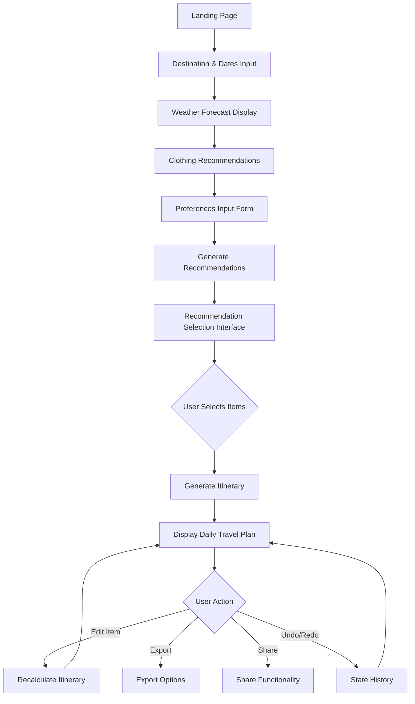
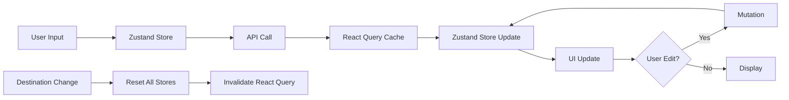

# Smart Travel Planning Application — Architecture Reference

This file is the single reference document for all AI agents working on any phase. Read the relevant sections before implementing a phase. Implementation phases are in `plan/phase-XX-*.md`.

> **IBM Bob Dev Day Hackathon context**: Built for the hackathon theme "Turn idea into impact faster". **IBM Bob IDE is the required development tool** — all work must be done through Bob IDE and Bob task session reports must be exported and committed to `bob_sessions/` in the repo root for judging. IBM Cloud services used: Code Engine (deployment), Cloudant (persistence). Gemini API is the AI provider. IBM watsonx products are available optionally.

---

## Table of Contents

1. [Core Architecture Principles](#core-architecture-principles)
2. [Technology Stack](#technology-stack)
3. [Design System](#design-system)
4. [User Flow Diagram](#user-flow-diagram)
5. [Detailed User Flow Steps](#detailed-user-flow-steps)
6. [Component Architecture](#component-architecture)
7. [AI Assistant Integration](#ai-assistant-integration)
8. [State Management Strategy](#state-management-strategy)
9. [API Design](#api-design)
10. [Data Models](#data-models)
11. [Error Handling & Resilience Architecture](#error-handling--resilience-architecture)
12. [Performance & Optimization Strategy](#performance--optimization-strategy)
13. [Testing Architecture & Quality Assurance](#testing-architecture--quality-assurance)
14. [Cost Analysis & Monetization Strategy](#cost-analysis--monetization-strategy)
15. [Success Metrics](#success-metrics)
16. [Risk Mitigation](#risk-mitigation)
17. [Future Enhancements](#future-enhancements)

---

## Core Architecture Principles

### AI Assistant Integration

**AI as Travel Companion**: The application features an AI assistant focused on core planning features. The AI provides:

- **Core AI Features** (where AI adds most value):
  - Contextual recommendations based on user preferences
  - Itinerary generation with optimal routing and timing
  - Real-time suggestions and alternatives via chat interface
  - Answers to travel-related questions
  - Proactive assistance (e.g., suggesting nearby cafes when there's a gap in the itinerary)

- **Cost Optimization Strategy**:
  - AI used ONLY for recommendations, itinerary generation, and chat
  - Static content for landing page, weather explanations, and form hints
  - Request coalescing and aggressive caching
  - Batch operations where possible
  - Target: $0.10 per user session
  - Monetization via premium features and affiliate commissions

### Streamlined Flow Architecture

**Phase 1: Onboarding & Preferences** — Destination and dates input, weather forecast + clothing recommendations (combined view), comprehensive preference collection.

**Phase 2: Discovery & Selection** — System generates contextual recommendations. Quick Start Mode pre-selects popular items; Detailed Mode lets users browse 12-card paginated grid. Users select places for THIS trip (NOT saved places or favorites). Minimum selections required before generating itinerary.

**Phase 3: Itinerary Generation & Refinement** — AI arranges selected places into chronological daily plan. AI assistant chat provides ongoing support. Full edit capability with AI recalculation. AI proactively suggests improvements.

**CRITICAL TERMINOLOGY**: This is NOT a "saved places" or "favorites" feature. Users are actively selecting places specifically for THIS trip. Use: "Select for your trip", "Add to plan", "Choose places" — NEVER "Save" or "Favorite".

### Smart Recalculation Strategy

**Tiered Recalculation Approach**:

- **Local-only edits** (no API call): Notes, descriptions, cosmetic changes
- **Partial recalculation** (local algorithms): Simple time shifts (±30 minutes), using local time-adjustment engine
- **Full AI recalculation** (API call): Structural changes (add/remove activities, major time changes)

**Performance Optimizations**: Debouncing (2-3 seconds) before triggering recalculation. Optimistic UI updates with rollback on error. Request coalescing for multiple rapid edits. Undo/redo functionality for user confidence.

### Server-First Approach

Default to Server Components for performance. Client Components only when necessary: forms and user input, interactive selections, real-time edits, AI chat interface, state-dependent UI.

---

## Technology Stack

### Core Framework

- **Next.js 14+**: App Router architecture
- **React 18+**: Server and Client Components
- **TypeScript**: Strict mode enabled
- **Tailwind CSS**: Utility-first styling with custom design system

### State Management

- **React Context**: Multi-step form data (destination, dates, preferences)
- **Zustand**: Complex itinerary state (undo/redo, edit tracking, AI chat history)
- **React Query (TanStack Query)**: Server data caching and synchronization

### Form Handling

- **React Hook Form**: Form state management
- **Zod**: Schema validation

### API Integration

- **Gemini API** (`@google/genai` >= 1.33.0): AI-powered recommendations, itinerary generation, and AI assistant
- **Weather API**: Real-time weather forecasts
- **Google Maps API** (optional): Location data and mapping

### Deployment & Infrastructure (IBM Cloud — Hackathon Account)

- **IBM Code Engine**: Serverless container hosting for the Next.js app
- **IBM Cloudant**: NoSQL document DB for persistent storage (user sessions, saved plans)
- **IBM Container Registry**: Docker image registry for the app container

> **Hackathon constraint**: The IBM Cloud account is pre-configured with only: Code Engine, Cloudant, Natural Language Understanding, Speech-to-Text, Text-to-Speech. No Redis available. Use React Query for in-memory caching; use Cloudant only for persistence. $80 IBM Cloud credits — plan usage carefully.

### UI Components

- **Custom Design System**: Based on provided Figma designs
- **Framer Motion**: Animations and transitions
- **React Icons**: Icon library
- **shadcn/ui**: Base reusable UI primitives

### Development Tools

- **ESLint**: Code linting
- **Prettier**: Code formatting
- **TypeScript**: Type checking
- **Vitest**: Unit and integration testing
- **Playwright**: E2E testing
- **MSW**: API mocking
- **Storybook**: Component development

---

## Design System

### Color Palette

- **Primary**: #2A7BFF (Blue) — Main actions, AI assistant branding, primary buttons
- **Secondary**: #6DD3B0 (Mint Green) — Success states, secondary actions, highlights
- **Tertiary**: #FF8C42 (Orange) — Warnings, highlights, attention-grabbing elements
- **Neutral**: #F8F9FA (Light Gray) — Backgrounds, cards, subtle elements
- **Text**: Dark gray (#3D4852) for body, black for headings

### Typography

- **Headline**: Plus Jakarta Sans (Bold, modern, friendly)
- **Body**: Be Vietnam Pro (Clean, readable, professional)
- **Label**: Be Vietnam Pro (Medium weight for form labels and UI text)

### Component Patterns

**Cards** — Rounded corners (12-16px radius), subtle shadows, image-first design with overlay text, hover elevation, category badges and tags.

**Buttons** — Primary: solid blue (#2A7BFF) with white text, rounded. Secondary: outlined/ghost. Tertiary: text-only with icon. Icon buttons: circular with colored backgrounds. Disabled: reduced opacity.

**Forms** — Clean inputs with subtle borders, icon prefixes, multi-select chips/pills for categories, slider for continuous values (budget, pace), date pickers with calendar view, inline validation feedback.

**Navigation** — Bottom tab bar for mobile (Home, Discover, Itinerary, Profile), sidebar for desktop with collapsible sections, progress indicator for multi-step flows, breadcrumbs for context.

**AI Assistant** — Chat bubble interface with avatar, collapsible panel (minimize/maximize), typing indicators, quick action buttons, message history with timestamps.

### Layout Principles

- **Mobile-first**: Optimized for mobile, scales up to desktop
- **Card-based**: Content in digestible, scannable cards
- **Visual hierarchy**: Large hero images, clear headings, scannable content
- **Whitespace**: Generous spacing for clarity
- **Grid system**: Consistent spacing and alignment

### Iconography

Rounded, friendly icon style. Consistent stroke width. Contextual colors (blue for info, green for success, orange for warning). Icons paired with labels for clarity.

---

## User Flow Diagram



---

## Detailed User Flow Steps

### Step 1: Landing Page & Onboarding

- **Component**: `LandingPage` (Server Component with Client interactive elements)
- **Features**: Hero section with AI assistant mascot/robot illustration, value proposition "Turn Your Travel Idea into Reality (faster)! with AI", "Start Planning" CTA button, brief explanation of how the AI assistant works
- **Design Notes**: Friendly, approachable design. AI character prominently featured.
- **Next Action**: Navigate to destination input

### Step 2: Destination and Dates Input

- **Component**: `DestinationForm` (Client Component)
- **Input Fields**: Destination (text input with autocomplete, icon prefix), Start date (date picker with calendar), End date (date picker with calendar)
- **Validation**: Dates must be valid, end date after start date
- **State**: Stored in Zustand FormStore
- **Next Action**: Fetch weather data and show forecast

### Step 3: Weather Forecast & Clothing Recommendations (Combined)

- **Component**: `WeatherDashboard` (Server Component)
- **Layout**: Combined view showing both weather and clothing
- **Weather Display**: Multi-day forecast cards, temperature range (high/low), weather icons (sunny, cloudy, rainy), precipitation probability, weather-appropriate badges
- **Clothing Recommendations**: Visual cards with clothing item icons, item names (Thin clothes, Sunglasses, Umbrella, Sunscreen), material/purpose descriptions, color-coded by category, warning badges for extreme weather (e.g., "Heavy denim uncomfortable in high humidity")
- **AI Integration**: AI provides personalized packing advice
- **Next Action**: Collect user preferences

### Step 4: Preferences Input ("Tell AI what you like")

- **Component**: `PreferencesForm` (Client Component)
- **Title**: "Tell AI what you like" — Customize your travel profile
- **Input Sections**:
  - **Travel Style** (Multi-select chips): Museums, Nature, Culinary, History, Nightlife, Shopping, Relaxation — icon + label, multiple selections allowed
  - **Budget** (3-tier visual selection): $ Budget, $$ Moderate, $$$ Luxury — single selection
  - **Transportation** (Icon-based): Train, Bus, Walk — multiple selections, icons with checkmarks when selected
  - **Group Dynamics** (Icon-based): Solo, Family, Pets — single selection
  - **Pace & Schedule** (Slider): Range from "Quick Bites" to "Long Dinners", "Balanced" in middle
  - **Meal Times** (Optional, expandable): Breakfast, lunch, dinner time preferences
  - **Dietary Restrictions** (Optional, multi-select chips)
  - **Accessibility Needs** (Optional, multi-select)
- **Validation**: Zod schema validation
- **State**: Stored in Zustand FormStore
- **Design Notes**: Progressive disclosure (optional fields collapsed). "Discover Places" CTA at bottom.
- **Next Action**: Generate and show recommendations

### Step 5: Discovery — Browse Recommendations

- **Component**: `DiscoveryPage` (Mixed: Server wrapper, Client interactive)
- **Title**: "Pick your places" or "Discover Places"
- **Quick Start Mode**: Pre-selects popular items for review before generating itinerary. Reduces friction.
- **Detailed Mode** (default): Full browsing and manual selection.
- **Layout**: Mode selector at top, search bar, category filter tabs (All, Attractions, Hotels, Restaurants), paginated grid (12 cards per page), selection counter/summary, pagination controls
- **Recommendation Cards**: Large image (Next.js Image with blur placeholder + lazy loading), category badge (top-left), title overlay, duration/time estimate, price range indicator, brief description, heart/checkbox for selection, hover for more details
- **Features**: Filter by category, search, sort (popular, price, duration), selected items counter, "Generate Itinerary" button enabled when minimum selections met
- **State**: Zustand SelectionStore
- **Validation**: Minimum selections required (at least 1 hotel, 3 attractions, 2 restaurants)
- **AI Integration**: AI suggests popular combinations or hidden gems

**IMPORTANT**: This is the ACTIVE SELECTION phase for THIS trip, NOT "saved places" or "favorites". Use: "Select for your trip", "Add to plan", "Choose places".

### Step 6: Itinerary Generation

- **Component**: `ItineraryGenerator` (Server Component wrapper)
- **API Call**: `/api/itinerary`
- **Process**: Send selected items + preferences to AI → AI generates chronological daily plan with optimal routing → includes travel times, meal times, rest periods, cultural context and attire suggestions
- **Loading State**: Progress indicator, AI animation, status messages ("Arranging your activities...", "Optimizing routes...")
- **Next Action**: Display generated itinerary

### Step 7: Itinerary Display ("Your AI-Generated Plan")

- **Component**: `ItineraryView` (Mixed: Server wrapper, Client interactive)
- **Title**: "Your AI-Generated Plan" with descriptive subtitle
- **Layout**: Day selector tabs (All Days, Day 1, Day 2...), timeline view per day, activity cards in chronological order, AI assistant panel (collapsible)
- **Activity Cards**: Timestamp (e.g., "09:00 AM"), duration indicator, large image, activity title, description, cultural context badges (e.g., "Quiet Manners", "Comfortable Shoes"), attire suggestions (e.g., "Casual preferred"), category tags, edit button, travel time to next activity
- **AI Assistant Panel**: Collapsible chat interface, AI avatar, message history, input field, quick action buttons, proactive suggestions
- **Interactive Features**: Tap to expand, edit button opens modal, drag-and-drop reordering (triggers recalculation), add/remove activities, undo/redo buttons in header, export and share buttons
- **State**: Zustand ItineraryStore with history

### Step 8: AI Assistant Interaction

- **Component**: `AIAssistant` (Client Component)
- **Features**: Chat bubbles, AI avatar with animations, typing indicators, quick action buttons, message history, context-aware responses
- **Capabilities**: Answer questions about destinations, suggest alternatives, find nearby places, adjust timing and pacing, explain cultural context, provide travel tips, recalculate itinerary
- **API**: `/api/ai/chat`
- **State**: Zustand AIStore

### Step 9: Itinerary Editing & Recalculation

- **Component**: `ActivityEditModal` (Client Component)
- **Features**: Edit activity details (time, duration, notes), replace activity with alternative, remove activity, add new activity, preview changes before applying
- **Recalculation**: API call to `/api/itinerary/recalculate`, AI adjusts subsequent activities, maintains logical flow, updates travel times, AI explains changes
- **State**: Optimistic updates with rollback on error
- **Next Action**: Return to itinerary view with updates

---

## Component Architecture

### Directory Structure

```
app/
├── (routes)/
│   ├── page.tsx                    # Landing page with AI
│   ├── plan/
│   │   ├── page.tsx                # Main planning flow orchestrator
│   │   ├── destination/
│   │   │   └── page.tsx            # Step 1: Destination input
│   │   ├── weather/
│   │   │   └── page.tsx            # Step 2: Weather & clothing combined
│   │   ├── preferences/
│   │   │   └── page.tsx            # Step 3: Preferences input
│   │   ├── discover/
│   │   │   └── page.tsx            # Step 4: Browse recommendations
│   │   └── itinerary/
│   │       └── page.tsx            # Step 5: Itinerary display
│   └── layout.tsx                  # Root layout with AI provider
├── api/
│   ├── weather/
│   │   └── route.ts                # Weather API endpoint
│   ├── recommendations/
│   │   └── route.ts                # Recommendations generation
│   ├── itinerary/
│   │   ├── route.ts                # Itinerary generation
│   │   └── recalculate/
│   │       └── route.ts            # Itinerary recalculation
│   └── ai/
│       └── chat/
│           └── route.ts            # AI chat endpoint
components/
├── landing/
│   ├── Hero.tsx                    # Landing hero with AI
│   ├── Features.tsx                # Feature highlights
│   └── CTASection.tsx              # Call to action
├── forms/
│   ├── DestinationForm.tsx         # Client Component
│   ├── PreferencesForm.tsx         # Client Component
│   ├── TravelStyleSelector.tsx     # Multi-select chips
│   ├── BudgetSelector.tsx          # 3-tier selection
│   ├── TransportationSelector.tsx  # Icon-based selection
│   ├── GroupDynamicsSelector.tsx   # Icon-based selection
│   ├── PaceSlider.tsx              # Slider component
│   └── FormField.tsx               # Reusable form field
├── weather/
│   ├── WeatherDashboard.tsx        # Combined weather & clothing
│   ├── WeatherForecast.tsx         # Server Component
│   ├── WeatherCard.tsx             # Daily forecast card
│   └── ClothingRecommendations.tsx # Clothing suggestions
├── discovery/
│   ├── DiscoveryPage.tsx           # Main discovery interface
│   ├── RecommendationCard.tsx      # Client Component
│   ├── RecommendationGrid.tsx      # Grid layout
│   ├── CategoryFilter.tsx          # Client Component
│   ├── SearchBar.tsx               # Client Component
│   └── SelectionSummary.tsx        # Selected items counter
├── itinerary/
│   ├── ItineraryView.tsx           # Main itinerary display
│   ├── DaySelector.tsx             # Day tabs
│   ├── DayTimeline.tsx             # Timeline for single day
│   ├── ActivityCard.tsx            # Activity card with details
│   ├── ActivityEditModal.tsx       # Edit modal
│   ├── TimelineView.tsx            # Visual timeline
│   └── EditControls.tsx            # Edit buttons
├── ai/
│   ├── AIAssistant.tsx             # Main AI component
│   ├── AIChat.tsx                  # Chat interface
│   ├── AIMessage.tsx               # Message bubble
│   ├── AIAvatar.tsx                # AI avatar with animations
│   ├── AIQuickActions.tsx          # Quick action buttons
│   └── AITypingIndicator.tsx       # Typing animation
├── ui/
│   ├── Button.tsx
│   ├── Card.tsx
│   ├── Input.tsx
│   ├── Select.tsx
│   ├── DatePicker.tsx
│   ├── Slider.tsx
│   ├── Chip.tsx
│   ├── Badge.tsx
│   ├── Modal.tsx
│   ├── Tabs.tsx
│   └── LoadingSpinner.tsx
└── layout/
    ├── Header.tsx
    ├── Footer.tsx
    ├── Sidebar.tsx
    ├── BottomNav.tsx
    └── ProgressIndicator.tsx
lib/
├── types/
│   ├── destination.ts
│   ├── preferences.ts
│   ├── recommendation.ts
│   ├── itinerary.ts
│   └── ai.ts
├── validations/
│   ├── destination.schema.ts
│   ├── preferences.schema.ts
│   └── itinerary.schema.ts
├── api/
│   ├── weather.ts
│   ├── gemini.ts
│   ├── maps.ts
│   └── ai.ts
├── utils/
│   ├── date.ts
│   ├── format.ts
│   ├── validation.ts
│   └── prompts.ts
└── stores/
    ├── formStore.ts
    ├── itineraryStore.ts
    ├── selectionStore.ts
    └── aiStore.ts
```

### Component Specifications

#### Server Components (Default)

**`WeatherForecast.tsx`** — Server Component. Props: `destination: string`, `startDate: Date`, `endDate: Date`. Fetches weather data server-side and renders static weather display.

**`ClothingRecommendations.tsx`** — Server Component. Props: `weatherData: WeatherData`. Generates clothing suggestions using rule-based logic (no AI) based on the weather data and renders static recommendations.

#### Client Components (Interactive)

**`DestinationForm.tsx`** — `'use client'`. Handles user input for destination and dates. Uses React Hook Form with Zod validation. On submit, stores data in `useFormStore` and navigates to weather step.

**`RecommendationSelector.tsx`** — `'use client'`. Props: `recommendations: Recommendation[]`. Uses Zustand `useSelectionStore`. Handles filter/search logic, selection toggles, and renders recommendation cards with checkboxes.

**`ItineraryView.tsx`** — `'use client'`. Props: `initialItinerary: Itinerary`. Uses Zustand `useItineraryStore` with history. Handles edit actions that trigger tiered recalculation, undo/redo, and renders day-by-day view with edit controls.

---

## AI Assistant Integration

### AI Assistant Role

**Cost-Optimized AI Integration**: The AI assistant is used only for:

- **Recommendation Generation**: Contextual recommendations based on preferences
- **Itinerary Generation**: Chronological daily plan with optimal routing, cultural context, attire suggestions, travel times
- **AI Chat Interface**: Travel questions, alternatives, nearby places, timing adjustments, cultural context, travel tips

**Static Content** (no AI, cost optimization): Landing page text, weather forecast display, clothing recommendations (rule-based logic), form hints and tooltips.

Model strategy: `gemini-3-flash-preview` for chat and recommendations (fast + cost-effective), `gemini-3.1-pro-preview` for itinerary generation (quality-critical). SDK: `@google/genai` (`npm install @google/genai`). API key: `GEMINI_API_KEY` env var. Client: `new GoogleGenAI({})` (picks up key automatically).

### AI Chat Interface

Component hierarchy: `AIAssistant` wraps `AIAvatar`, `AIChat` (which contains `AIMessage` instances and `AITypingIndicator`), `AIQuickActions`, and `AIInput`.

**Message Types**:

- **Proactive Suggestions**: AI initiates conversation
- **User Questions**: User asks AI
- **Confirmations**: AI confirms actions
- **Explanations**: AI explains changes
- **Recommendations**: AI suggests alternatives

**Quick Actions**: "Find nearby cafe", "Adjust timing", "Suggest alternative", "Explain cultural context", "Optimize route"

### AI API Types

```typescript
interface AIChatRequest {
  message: string;
  context: {
    currentStep: "destination" | "weather" | "preferences" | "discovery" | "itinerary";
    itinerary?: Itinerary;
    selectedRecommendations?: Recommendation[];
    preferences?: UserPreferences;
    destination?: string;
  };
  previousInteractionId?: string; // Gemini Interactions API manages history server-side
}

interface AIChatResponse {
  message: string;
  interactionId: string; // store in AIStore; send back as previousInteractionId on next turn
  suggestions?: string[];
  actions?: AIAction[];
  updatedItinerary?: Itinerary;
}

interface AIAction {
  type: "add_activity" | "remove_activity" | "adjust_time" | "suggest_alternative" | "find_nearby";
  payload: any;
  label: string;
}
```

**AI Prompt (chat endpoint)**:

```
You are a friendly AI travel assistant helping users plan their trips.

Your personality:
- Friendly and approachable
- Proactive and helpful
- Knowledgeable about travel
- Conversational and natural
- Encouraging and positive

Current context:
- Step: [current step]
- Destination: [destination]
- Itinerary: [itinerary if available]
- Selected places: [selections if available]
- Preferences: [preferences if available]

Conversation history:
[Previous messages]

User message: [User's question/request]

Instructions:
1. Respond naturally and conversationally
2. Provide specific, actionable suggestions
3. If the user asks to modify the itinerary, provide the updated itinerary
4. Offer quick action buttons when appropriate
5. Be proactive - suggest improvements even if not asked
6. Explain your reasoning briefly
7. Keep responses concise but helpful

Respond with:
- message: Your conversational response
- suggestions: Array of follow-up suggestions (optional)
- actions: Array of quick action buttons (optional)
- updatedItinerary: Modified itinerary if applicable (optional)
```

---

## State Management Strategy

### Two-Layer State Architecture

**Consolidated Approach**: Zustand for all client state, React Query for server data.

#### Layer 1: Client State (Zustand)

```typescript
// Form Data Store (replaces React Context)
interface FormStore {
  destination: string;
  startDate: Date;
  endDate: Date;
  travelers: number;
  preferences: UserPreferences;
  updateDestination: (data: DestinationData) => void;
  updatePreferences: (prefs: UserPreferences) => void;
  reset: () => void;
}

// Selection Store
interface SelectionStore {
  selectedRecommendations: Recommendation[];
  addSelection: (rec: Recommendation) => void;
  removeSelection: (id: string) => void;
  clearSelections: () => void;
  isSelected: (id: string) => boolean;
  getSelectionsByCategory: (category: string) => Recommendation[];
}

// Itinerary Store with History
interface ItineraryStore {
  itinerary: Itinerary;
  history: Itinerary[];
  historyIndex: number;
  updateItinerary: (itinerary: Itinerary) => void;
  editActivity: (dayIndex: number, activityIndex: number, changes: Partial<Activity>) => void;
  undo: () => void;
  redo: () => void;
  canUndo: boolean;
  canRedo: boolean;
}

// AI Chat Store
interface AIStore {
  messages: AIMessage[];
  isTyping: boolean;
  currentInteractionId?: string; // tracks Gemini server-side conversation chain
  addMessage: (message: AIMessage) => void;
  setTyping: (typing: boolean) => void;
  setInteractionId: (id: string) => void;
  clearHistory: () => void; // also clears currentInteractionId
}
```

A `resetAllStores()` helper calls `reset()` / `clearSelections()` / `updateItinerary(null)` / `clearHistory()` (which also clears `currentInteractionId`) on all four stores. It is triggered on destination change and also invalidates the React Query cache.

**State Synchronization**: Destination change triggers `resetAllStores()` and React Query cache invalidation. localStorage persistence for form data (auto-save every 30 seconds).

#### Layer 2: Server Data (React Query)

- **Weather**: `useQuery` with key `['weather', destination, startDate, endDate]` and `staleTime: 30 minutes`.
- **Recommendations**: `useQuery` with key `['recommendations', destination, preferences]` and `staleTime: Infinity` (don't refetch unless invalidated).
- **Itinerary recalculation**: `useMutation` — on success, calls `itineraryStore.updateItinerary(newItinerary)`.
- **AI chat**: `useMutation` — on success, calls `aiStore.addMessage(response)`, `aiStore.setInteractionId(response.interactionId)`, and `aiStore.setTyping(false)`.

**Rationale**: Automatic caching, loading states, error handling, and optimistic updates.

### State Flow Diagram



---

## API Design

### 1. Weather API (`/api/weather`)

**Method**: GET  
**Query Parameters**: `destination: string`, `startDate: ISO date string`, `endDate: ISO date string`

```typescript
interface WeatherResponse {
  location: string;
  forecast: DailyForecast[];
  clothingRecommendations: ClothingItem[];
}

interface DailyForecast {
  date: string;
  tempHigh: number;
  tempLow: number;
  condition: string;
  precipitation: number;
  uvIndex: number;
  humidity: number;
}

interface ClothingItem {
  name: string;
  description: string;
  icon: string;
  category: "clothing" | "accessory";
  warning?: string;
}
```

**Implementation**: Call external weather API (OpenWeatherMap / WeatherAPI). Generate clothing recommendations using rule-based logic (not AI). Transform to consistent format. Cache 30 minutes. Implement retry with exponential backoff. Handle invalid location errors.

---

### 2. Recommendations API (`/api/recommendations`)

**Method**: POST

```typescript
interface RecommendationsRequest {
  destination: string;
  startDate: string;
  endDate: string;
  travelers: number;
  preferences: UserPreferences;
}

interface RecommendationsResponse {
  recommendations: Recommendation[];
}

interface Recommendation {
  id: string;
  name: string;
  description: string;
  category: "attraction" | "hotel" | "restaurant";
  estimatedDuration: number; // minutes
  priceRange: 1 | 2 | 3;
  location: {
    address: string;
    coordinates: { lat: number; lng: number };
  };
  openingHours: string;
  culturalNotes: string;
  imageUrl?: string;
  imageSource?: "places" | "unsplash" | "placeholder";
  blurDataURL?: string;
  tags: string[];
}
```

**Hybrid Image + Data Approach**:

1. **Google Places API** (hotels/restaurants): Verified data + photos (~$0.017/photo)
2. **Unsplash API** (attractions): Free tier, 50 req/hour, search by place name + city
3. **Gemini API**: Generates contextual recommendation names and descriptions
4. **Image Fallback**: Google Places → Unsplash → category-specific gradient placeholder

The `fetchRecommendationImage()` service function tries Google Places first (hotels/restaurants), then Unsplash (attractions or fallback), then a category-specific gradient placeholder. Each path generates a blur placeholder server-side.

**Implementation**: Use Gemini API (`gemini-3-flash-preview`) via `@google/genai`. Parallelize API calls with `Promise.all`. Handle partial failures via `Promise.allSettled`. Cache with React Query (`staleTime: Infinity` for recommendations). For popular destinations, consider Cloudant as a persistent response cache. Implement retry + circuit breaker + rate limiting. Validate AI response with Zod schemas.

**AI Prompt**:

```
Generate travel recommendations for [destination] from [startDate] to [endDate].

User preferences:
- Travel style: [styles]
- Budget: [budget]
- Group: [group]
- Transportation: [transport]
- Pace: [pace]

Provide 15-20 attractions, 5-7 hotels, and 10-15 restaurants that match these preferences.
Format as JSON array with fields: name, description, category, estimatedDuration, priceRange,
location (address, coordinates), openingHours, culturalNotes, tags.

DO NOT include imageUrl - images will be fetched separately.

Focus on authentic, diverse experiences that match the user's travel style.
```

---

### 3. Itinerary Generation API (`/api/itinerary`)

**Method**: POST

```typescript
interface ItineraryRequest {
  destination: string;
  startDate: string;
  endDate: string;
  travelers: number;
  preferences: UserPreferences;
  selectedRecommendations: Recommendation[];
}

interface ItineraryResponse {
  itinerary: Itinerary;
}

interface Itinerary {
  id: string;
  destination: string;
  startDate: string;
  endDate: string;
  days: DayPlan[];
}

interface DayPlan {
  date: string;
  activities: Activity[];
}

interface Activity {
  id: string;
  time: string;
  duration: number;
  type: "attraction" | "meal" | "rest" | "travel";
  recommendation: Recommendation;
  culturalContext: string;
  attireSuggestion: string;
  travelTime?: number; // to next activity
}
```

**Implementation**: Use Gemini API (`gemini-3.1-pro-preview`) via `@google/genai`. Consider meal times, rest periods, pace. Optimize geographic flow. Calculate realistic travel times. Add cultural context and attire suggestions. Validate timing constraints. Retry on error. Add request coalescing for duplicate requests.

**AI Prompt**:

```
Create a detailed daily itinerary for [destination] from [startDate] to [endDate].

Selected items:
[List of selected recommendations]

User preferences:
- Breakfast time: [time]
- Lunch time: [time]
- Dinner time: [time]
- Rest period: [time]
- Travel style: [style]

Requirements:
1. Chronological order by day
2. Realistic timing with travel between locations
3. Include meals at selected restaurants
4. Add rest periods as requested
5. Optimize geographic flow
6. Include cultural context and attire suggestions for each activity

Format as JSON: days[{date, activities[{time, duration, type, recommendation, culturalContext, attireSuggestion, travelTime}]}]
```

---

### 4. Itinerary Recalculation API (`/api/itinerary/recalculate`)

**Method**: POST

```typescript
interface RecalculateRequest {
  currentItinerary: Itinerary;
  edit: {
    dayIndex: number;
    activityIndex: number;
    changes: Partial<Activity>;
  };
}

interface RecalculateResponse {
  itinerary: Itinerary;
  changedDays: number[]; // indices of days that changed
}
```

**Implementation**: Apply user edit. Use Gemini API (`gemini-3.1-pro-preview`) to recalculate affected portions. Maintain consistency. Optimize timing. Return updated itinerary with change tracking. Rollback on failure.

**AI Prompt**:

```
Recalculate travel itinerary after user edit.

Original itinerary:
[Current itinerary JSON]

User edit:
Day [X], Activity [Y]: [Changes]

Requirements:
1. Apply the edit
2. Adjust subsequent activities on the same day
3. Ensure realistic timing
4. Maintain geographic flow
5. Keep other days consistent unless timing requires changes

Return full updated itinerary as JSON.
```

---

### 5. AI Chat API (`/api/ai/chat`)

**Method**: POST

```typescript
interface AIChatRequest {
  message: string;
  context: {
    currentStep: "destination" | "weather" | "preferences" | "discovery" | "itinerary";
    itinerary?: Itinerary;
    selectedRecommendations?: Recommendation[];
    preferences?: UserPreferences;
    destination?: string;
  };
  previousInteractionId?: string; // Gemini manages history server-side
}

interface AIChatResponse {
  message: string;
  interactionId: string; // returned from Gemini; client stores and sends back next turn
  suggestions?: string[];
  actions?: AIAction[];
  updatedItinerary?: Itinerary;
}

interface AIAction {
  type: "add_activity" | "remove_activity" | "adjust_time" | "suggest_alternative" | "find_nearby";
  payload: any;
  label: string;
}
```

**Implementation**: Use Gemini Interactions API (`gemini-3-flash-preview`) via `client.interactions.create()`. Pass `previous_interaction_id` for server-managed conversation state (no need to send full history). Use `stream: true` for streaming; consume chunks via `chunk.event_type === 'content.delta'`. Return `interaction.id` as `interactionId` in the response. Rate limit: 5 requests/minute via `aiRateLimiter`. Circuit breaker pattern via `geminiCircuitBreaker`.

See [AI Assistant Integration](#ai-assistant-integration) for the full prompt template.

### API Error Handling

All API routes: HTTP 200 with `{ data }` on success. `ValidationError` → HTTP 400 with `{ error: 'Invalid input', details }`. `AIError` → HTTP 503 with `{ error: 'AI service error', details }`. All other errors → HTTP 500 with `{ error: 'Internal server error' }`.

---

## Data Models

### TypeScript Interfaces

```typescript
// lib/types/destination.ts
export interface DestinationData {
  destination: string;
  startDate: Date;
  endDate: Date;
}

// lib/types/preferences.ts
export interface UserPreferences {
  travelStyle: string[]; // ['museums', 'nature', 'culinary', etc.]
  budget: "budget" | "moderate" | "luxury";
  transportation: string[]; // ['train', 'bus', 'walk']
  groupDynamics: "solo" | "family" | "pets";
  pace: number; // 0-100 slider value
  mealTimes?: {
    breakfast?: string;
    lunch?: string;
    dinner?: string;
  };
  dietaryRestrictions?: string[];
  accessibilityNeeds?: string[];
}

// lib/types/recommendation.ts
export interface Recommendation {
  id: string;
  name: string;
  description: string;
  category: "attraction" | "hotel" | "restaurant";
  estimatedDuration: number; // minutes
  priceRange: 1 | 2 | 3;
  location: {
    address: string;
    coordinates: { lat: number; lng: number };
  };
  openingHours: string;
  culturalNotes: string;
  imageUrl: string;
  tags: string[];
}

// lib/types/itinerary.ts
export interface Itinerary {
  id: string;
  destination: string;
  startDate: string;
  endDate: string;
  days: DayPlan[];
  summary: string;
  metadata: {
    createdAt: string;
    updatedAt: string;
    version: number;
  };
}

export interface DayPlan {
  date: string;
  activities: Activity[];
  summary: string;
}

export interface Activity {
  id: string;
  time: string; // HH:MM format
  duration: number; // minutes
  type: "attraction" | "meal" | "rest" | "travel";
  recommendation: Recommendation;
  culturalContext: string;
  attireSuggestion: string;
  travelTime?: number; // minutes to next activity
  notes?: string;
}

// lib/types/weather.ts
export interface WeatherData {
  location: string;
  forecast: DailyForecast[];
  clothingRecommendations: ClothingItem[];
}

export interface DailyForecast {
  date: string;
  tempHigh: number;
  tempLow: number;
  condition: "sunny" | "cloudy" | "rainy" | "snowy" | "windy";
  precipitation: number; // percentage
  uvIndex: number;
  humidity: number;
}

export interface ClothingItem {
  name: string;
  description: string;
  icon: string;
  category: "clothing" | "accessory";
  warning?: string;
}

// lib/types/ai.ts
export interface AIMessage {
  id: string;
  role: "user" | "assistant";
  content: string;
  timestamp: string;
  suggestions?: string[];
  actions?: AIAction[];
}

export interface AIAction {
  type: "add_activity" | "remove_activity" | "adjust_time" | "suggest_alternative" | "find_nearby";
  payload: any;
  label: string;
}
```

### Zod Validation Schemas

```typescript
// lib/validations/destination.schema.ts
import { z } from "zod";

export const destinationSchema = z
  .object({
    destination: z.string().min(2, "Destination must be at least 2 characters"),
    startDate: z.date(),
    endDate: z.date(),
  })
  .refine((data) => data.endDate > data.startDate, {
    message: "End date must be after start date",
    path: ["endDate"],
  });

// lib/validations/preferences.schema.ts
export const preferencesSchema = z.object({
  travelStyle: z.array(z.string()).min(1, "Select at least one travel style"),
  budget: z.enum(["budget", "moderate", "luxury"]),
  transportation: z.array(z.string()).min(1, "Select at least one transportation method"),
  groupDynamics: z.enum(["solo", "family", "pets"]),
  pace: z.number().min(0).max(100),
  mealTimes: z
    .object({
      breakfast: z
        .string()
        .regex(/^([0-1]?[0-9]|2[0-3]):[0-5][0-9]$/)
        .optional(),
      lunch: z
        .string()
        .regex(/^([0-1]?[0-9]|2[0-3]):[0-5][0-9]$/)
        .optional(),
      dinner: z
        .string()
        .regex(/^([0-1]?[0-9]|2[0-3]):[0-5][0-9]$/)
        .optional(),
    })
    .optional(),
  dietaryRestrictions: z.array(z.string()).optional(),
  accessibilityNeeds: z.array(z.string()).optional(),
});
```

---

## Error Handling & Resilience Architecture

### Three-Tier Error Strategy

1. **Client-Side Validation** — Prevent errors before they happen (Zod schemas, pre-flight validation)
2. **API-Level Error Handling** — Graceful degradation (retry logic, circuit breakers, partial failure handling)
3. **User-Facing Recovery** — Clear feedback and recovery options (error boundary, helpful messages)

### API Retry Logic

The `retryWithBackoff(fn, maxRetries=3, baseDelay=1000)` utility retries an async function up to `maxRetries` times using exponential backoff: delays of 1s, 2s, 4s. On final failure, it re-throws the error. Located at `lib/utils/retry.ts`.

### Pre-Flight Validation

Before calling `/api/itinerary`, validate:

1. **Geographic feasibility**: Max 300km distance between any selected locations.
2. **Time feasibility**: Total `estimatedDuration` sum must be ≤ 80% of available trip hours.
3. **Category balance**: At least one hotel must be selected.

Show user-friendly errors for each failed check.

### State Persistence

The `useAutoSave()` hook saves form state and selections to `localStorage` key `'travel-plan-draft'` every 30 seconds via `setInterval`. Saved structure: `{ form, selections, timestamp }`.

### Error Recovery UI

```typescript
interface ErrorState {
  type: "network" | "api" | "validation" | "unknown";
  message: string;
  recoveryOptions: RecoveryOption[];
}

const errorMessages = {
  network: {
    title: "Connection Lost",
    message: "Please check your internet connection and try again.",
    actions: ["Retry", "Save Draft", "Go Offline"],
  },
  api: {
    title: "Service Temporarily Unavailable",
    message: "Our AI service is experiencing high demand. Your selections are saved.",
    actions: ["Retry", "Try Later", "Use Basic Mode"],
  },
  validation: {
    title: "Invalid Selection",
    message: "Some of your selections need adjustment.",
    actions: ["Review Selections", "Get Suggestions"],
  },
};
```

### Partial Failure Handling

Recommendations fetch uses `Promise.allSettled` across three parallel calls (Google Places, Unsplash, Gemini). Each can fail independently; successful results are merged and failures surface as warnings to the UI. The result includes a `partial: boolean` flag.

### Rate Limit Handling

A client-side `RateLimiter` class enforces a maximum of 5 AI API requests per minute (minimum 12-second interval between requests) using a FIFO queue. Export as `aiRateLimiter` singleton from `lib/utils/rate-limiter.ts`.

### Circuit Breaker Pattern

A `CircuitBreaker` class opens after 3 consecutive failures, stays open for 1 minute, then enters half-open state for a single probe request. States: `closed` → `open` → `half-open` → `closed`. Export as `geminiCircuitBreaker` singleton from `lib/utils/circuit-breaker.ts`.

---

## Performance & Optimization Strategy

### Performance Targets

- **Initial Load**: < 3 seconds (LCP)
- **Route Transitions**: < 1 second
- **API Response**: < 5 seconds (with loading states)
- **Bundle Size**: < 500KB (gzipped)
- **Lighthouse Score**: > 90

### Image Optimization

`RecommendationCard` uses `next/image` with `placeholder='blur'`, `blurDataURL` from the `Recommendation` object, `loading='lazy'`, and responsive `sizes` for three breakpoints: `(max-width: 768px) 100vw`, `(max-width: 1200px) 50vw`, `33vw`.

Image Processing Pipeline: Fetch from Google Places/Unsplash → generate blur placeholder (server-side) → convert to WebP → serve responsive sizes via CDN.

### Pagination Strategy

Discovery page uses `useQuery` with a `page` state variable and `ITEMS_PER_PAGE = 12`. The query key includes the page number. `keepPreviousData: true` for smooth pagination transitions.

### Code Splitting

- **Route-based**: `AIAssistant` and `ItineraryEditor` are lazy-loaded via `next/dynamic` with skeleton fallbacks. `AIAssistant` uses `ssr: false` (client-only).
- **Component-level**: `mapbox-gl`, `recharts`, and `react-datepicker` loaded on-demand.

### API Parallelization

Recommendations generation parallelizes three calls via `Promise.all`: Google Places fetch, Unsplash image search, and Gemini AI suggestions. Results are merged before returning.

### State Optimization

Subscribe to specific store slices (`useFormStore(state => state.destination)`) rather than the full store to prevent unnecessary re-renders. `RecommendationCard` is wrapped in `React.memo` with a custom comparator checking `recommendation.id` and `isSelected` equality.

### Virtual Scrolling

Itinerary timeline uses `@tanstack/react-virtual`'s `useVirtualizer` with estimated item size of 200px and 5-item overscan, enabling performant rendering of long activity lists.

### Caching Strategy (Two-Layer — No Redis)

1. **React Query Cache** (in-memory, 5-30 minutes) — primary cache for all API responses
2. **localStorage** (persistent, user drafts via auto-save)

> Redis is not available in the hackathon IBM Cloud account. React Query `staleTime` handles deduplication and caching within a session. For popular destinations, consider Cloudant as a persistent response cache if needed.

### Bundle Optimization

Add `ANALYZE=true next build` via `@next/bundle-analyzer`. Use named sub-path imports (e.g., `date-fns/format`) rather than barrel imports to enable tree shaking.

### Progressive Loading

`RecommendationSkeleton` renders an `animate-pulse` card with a 48px-high gray image placeholder and two text line placeholders (75% and 50% width).

The AI chat API route uses Gemini Interactions API with `stream: true`. The route streams chunks via `ReadableStream`, forwarding `chunk.delta.text` for each `content.delta` event. Response headers: `Content-Type: text/event-stream`, `Cache-Control: no-cache`.

---

## Testing Architecture & Quality Assurance

### Testing Strategy

**Testing Pyramid**: Unit Tests 60%, Integration Tests 30%, E2E Tests 10%.

### Testing Stack

- **Vitest**: Unit and integration testing
- **React Testing Library**: Component testing
- **Playwright**: E2E testing
- **MSW (Mock Service Worker)**: API mocking
- **Storybook + Chromatic**: Visual regression testing

### Unit Testing Targets

- `FormStore`: `updateDestination()` stores data correctly; `reset()` clears all fields.
- `retryWithBackoff()`: Succeeds on first try; retries on failure (up to 3 times); throws after max retries.

### Integration Testing Targets

MSW mocks `https://generativelanguage.googleapis.com/` (Gemini API base URL). Test `POST /api/recommendations` returning HTTP 200 with a structured recommendations array matching the `Recommendation` interface.

### Component Testing Targets

`RecommendationCard`: renders name and description. `onSelect` callback fires when button is clicked.

### E2E Critical Flows (Playwright)

1. **Full planning flow**: landing → fill destination/dates → weather visible → select preferences → select 3 recommendations → generate itinerary → verify activity cards visible.
2. **AI chat**: navigate to itinerary, open chat panel, send "Find a nearby cafe", verify response message appears.

### AI Response Validation

AI responses are validated against `aiRecommendationsSchema` (an array of `recommendationSchema` objects using Zod `.parse()`). Invalid AI output throws a `ZodError` before it reaches the client.

### Visual Regression Testing

Storybook stories for `RecommendationCard`: `Default` story (standard recommendation object); `Selected` story (with `isSelected: true`).

### Performance Testing (Lighthouse CI)

Thresholds: performance ≥ 0.9, accessibility ≥ 0.9, FCP ≤ 2000ms, LCP ≤ 3000ms, CLS ≤ 0.1. Tested URLs: `/`, `/plan/destination`, `/plan/discover`.

### CI/CD Pipeline (GitHub Actions)

On push/PR: install deps → unit tests → integration tests → E2E tests → upload coverage to Codecov → run Lighthouse CI.

### Coverage Targets

- **Overall**: 70% minimum
- **Critical paths** (form stores, API routes, validation, error handling): 80%
- **UI components**: 60%
- **Utilities**: 90%

---

## Cost Analysis & Monetization Strategy

### Cost Breakdown (Per User Session)

| Item                                      | Cost                   |
| ----------------------------------------- | ---------------------- |
| Recommendations generation (Gemini Flash) | ~$0.01                 |
| Itinerary generation (Gemini Pro)         | ~$0.02                 |
| Recalculation avg 2x (Gemini Pro)         | ~$0.02                 |
| AI chat avg 2 messages (Gemini Flash)     | ~$0.005                |
| Google Places API (30 places)             | $0.30                  |
| Unsplash API                              | Free (50 req/hr limit) |
| Weather API                               | Free tier sufficient   |
| **Total per session**                     | ~$0.36                 |

**IBM Cloud infrastructure** (hackathon account): $80 credits provided. Code Engine serverless billing (pay per vCPU-second + GB-second) + Cloudant Lite tier (free for low usage). Track spend carefully — account suspends at 100% usage.

> **No Redis**: remove all Redis/Upstash references from implementation. Use React Query caching only.

### Cost Optimization Strategies

1. **React Query Caching**: `staleTime: Infinity` for recommendations (never refetch unless destination changes); `staleTime: 30min` for weather.
2. **Request Coalescing**: A `Map<string, Promise>` keyed by `destination:hashedPreferences` ensures concurrent requests share the same in-flight Gemini call.
3. **Tiered Models**: `gemini-3-flash-preview` for recommendations and chat (cost-effective); `gemini-3.1-pro-preview` for itinerary generation (quality-critical).
4. **Batch Google Places requests**: 30 places in 3 calls instead of 30. Use Unsplash search over individual photo requests. Implement local time-adjustment algorithms (no AI needed).

### Cost Monitoring

The `trackAPICall(type, cost, userId)` utility (`lib/analytics/cost-tracking.ts`) fires an analytics event per API call, then checks the user's cumulative cost total; if it exceeds $5, it fires a cost-threshold alert. **Hackathon note**: Monitor IBM Cloud credit consumption at 25%/50%/80% usage alerts — account suspends at 100%. Reports: total API costs by type (Gemini, Google Places, Unsplash), cost per session, cost trends.

### Monetization Strategy

**Freemium**:

- Free: 1 itinerary/month, 3 AI chat messages/session, basic recommendations
- Premium ($9.99/month): Unlimited itineraries, unlimited chat, advanced features (undo/redo, export, sharing), priority support

**Affiliate Commissions**: Hotel bookings 4-8%, restaurant reservations $1-3/booking, activity tickets 5-10%.

**B2B Licensing**: Travel agencies $500/month, corporate $1,000/month, white-label $5,000/month.

**Revenue Projection (10K users)**: ~$28,000/month revenue, ~$4,045/month costs → ~85% margin.

---

## Success Metrics

### User Experience

- **Task Completion Rate**: >90% of users complete full flow
- **Time to Itinerary**: <5 minutes from start to generated itinerary
- **Edit Success Rate**: >95% of edits result in valid recalculation
- **User Satisfaction**: >4.5/5 rating

### Technical

- **Page Load Time**: <2 seconds initial load
- **API Response Time**: <3 seconds for recommendations, <5 seconds for itinerary
- **Error Rate**: <1% of API calls fail
- **Uptime**: >99.9% availability

### Business

- **User Retention**: >60% return within 30 days
- **Recommendation Acceptance**: >70% of recommendations selected
- **Itinerary Completion**: >80% of generated itineraries are used

---

## Risk Mitigation

**AI API failures or slow responses** → Retry logic, fallback responses, timeout handling. Cache previous successful responses, provide manual input option.

**State management complexity** → Use Zustand + React Query, comprehensive testing. Simplify state structure, reduce undo history depth if needed.

**Performance issues with large itineraries** → Pagination, lazy loading, code splitting. Limit itinerary length, optimize rendering.

**Users confused by two-phase architecture** → Clear progress indicators, explanatory text, onboarding flow. Add tutorial, provide examples.

**Recalculation takes too long** → Optimistic updates, progress indicators, partial recalculation. Reduce recalculation scope, cache intermediate results.

**Recommendations not relevant** → Refine AI prompts, add user feedback, improve preference collection. Allow manual addition of items.

---

## Future Enhancements

- User accounts and saved itineraries
- Collaborative planning (multiple users) + real-time collaboration
- Mobile app (React Native), offline mode
- Integration with booking platforms, budget tracking, expense splitting
- Social features (share trips, follow travelers)
- Multi-destination trips, seasonal recommendations, local events integration
- GraphQL API, WebSocket for real-time updates, PWA
- Machine learning for personalization, A/B testing framework
- Internationalization (i18n), multi-language support
